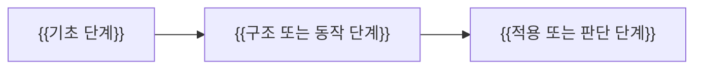

# {{TOPIC_TITLE}} 학습 로드맵

> {{누구를 위한 과정이며 어디까지 이해하게 되는지 설명}}

## 대상 독자

{{현재 지식 수준과 학습 상황}}

## 최종 학습 목표

- {{과정을 마친 뒤 설명할 수 있는 것}}
- {{과정을 마친 뒤 예측할 수 있는 것}}
- {{과정을 마친 뒤 판단하거나 구현할 수 있는 것}}

## 시작 전 확인

- {{필수 선수 지식}}
- {{알면 도움이 되지만 과정에서 복습하는 지식}}

## 표기와 분석 도구

| 기호·도구 | 의미 | 단위 또는 적용 범위 |
| --- | --- | --- |
| {{SYMBOL_OR_TOOL}} | {{MEANING}} | {{UNIT_OR_SCOPE}} |

## 전체 학습 지도

## 학습 순서

| 순서 | 장 | 깊이 | 중심 질문 | 분석 방법 | 선수 지식 | 근거·실습 |
| --- | --- | --- | --- | --- | --- | --- |
| 01 | [{{LESSON_TITLE}}](./01-{{LESSON_SLUG}}.md) | {{foundation-mechanism-advanced}} | {{QUESTION}} | {{TRACE_MODEL_DIAGNOSIS}} | {{PREREQUISITE}} | [조사]({{RESEARCH_PATH}}) · [실습]({{PRACTICE_PATH}}) |

## 이 순서로 배우는 이유

{{선수 관계와 인지적 난이도를 기준으로 순서를 설계한 이유}}

## 학습 방법

1. {{예측 질문에 먼저 답하기}}
2. {{시각화와 실행 추적으로 동작 확인하기}}
3. {{확인 문제로 회상·예측·적용 검증하기}}

## 완료 기준

- {{암기가 아니라 설명과 예측으로 확인할 기준}}
- {{수치 계산, 실행 추적, 실패 진단 또는 설계 선택으로 확인할 기준}}

## 근거 범위와 제한

{{조사 자료의 대상 버전, 확인일, 남아 있는 불확실성}}
