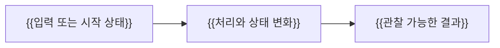

# {{LESSON_TITLE}}

> 중심 질문: **{{이 단계를 마치면 답할 수 있어야 하는 질문}}**

## 이 단계의 위치

- 이전: {{이미 배운 개념 또는 시작점}}
- 현재: {{이번 단계에서 연결할 핵심 개념}}
- 다음: {{이번 이해를 바탕으로 배울 내용}}

## 학습 목표

- {{설명할 수 있는 것}}
- {{결과를 예측할 수 있는 것}}
- {{새로운 상황에 적용할 수 있는 것}}

## 먼저 생각해 보기

{{학습자가 기존 지식으로 결과를 예상해 볼 구체적인 문제 상황}}

## 1. 기초 개념

{{용어를 사용하기 전에 정의하고 문제 상황과 연결}}

## 2. 정신 모델

> 정신 모델: {{복잡한 동작을 이해하기 위한 최소 모델}}

{{이 모델이 설명하는 범위와 실제 구현에서는 달라질 수 있는 한계}}

## 3. 상세 동작

{{구성 요소의 책임과 내부 동작을 원인 → 변화 → 결과 순서로 설명}}

### 데이터 플로우



## 4. 단계별 예제

```text
{{실제 값을 포함한 최소 실행 예제. 적절한 언어로 변경}}
```

| 단계 | 입력 또는 상태 | 발생한 일 | 결과 |
| --- | --- | --- | --- |
| 1 | {{VALUE}} | {{ACTION}} | {{RESULT}} |

{{예제가 핵심 개념을 어떻게 증명하는지 설명}}

## 5. 인터랙티브 시각화 설계

| 요소 | 설계 |
| --- | --- |
| 핵심 상태 | {{화면에 표시할 데이터와 상태}} |
| 사용자 조작 | {{바꿀 수 있는 입력, 조건, 단계 또는 속도}} |
| 상태 전이 | {{조작 후 발생하는 변화와 애니메이션 순서}} |
| 관찰 피드백 | {{원인과 결과를 연결해 보여줄 값과 설명}} |
| 제어 | {{재생, 일시 정지, 단계 이동, 초기화}} |
| 접근성 | {{키보드, 모션 감소, 색상 외 구분 방식}} |

## 6. 트레이드오프와 경계 조건

- {{이 접근이 적합한 조건}}
- {{얻게 되는 이점과 지불하는 비용}}
- {{동작이 달라지는 버전, 환경 또는 예외}}

## 7. 흔한 오해와 반례

### 오해: {{흔한 오해}}

{{왜 정확하지 않은지 설명하고 반례 또는 실패 사례로 경계를 확인}}

## 8. 이해도 점검

### 회상

1. {{핵심 개념을 자료 없이 설명하는 질문}}

### 예측

2. {{입력이나 조건이 바뀌었을 때 결과를 예측하는 질문}}

### 적용

3. {{새로운 상황에서 선택하고 근거를 설명하는 질문}}

## 핵심 요약

- {{가장 중요한 원리}}
- {{기억해야 할 인과관계}}
- {{적용 범위와 한계}}

## 다음 단계

{{다음 중심 질문과 이번 단계의 연결점}}

## 참고 자료

- [{{공식 자료 제목}}]({{DIRECT_URL}}) — {{기관 또는 프로젝트}}, {{적용 버전}}, {{YYYY-MM-DD}} 확인
