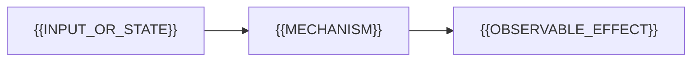

# {{CHAPTER_TITLE}}

> **이 장의 질문:** {{독자가 장 전체를 통해 답할 하나의 비단순 질문}}

{{앞 장의 결론 또는 현실 문제에서 이번 질문이 왜 생기는지 2~4개의 연결된 문단으로 도입한다.}}

## 제품을 먼저 이해하기

> 제품·프로젝트 과정의 첫 overview 장에만 사용하고 이후 장이나 순수 개념 과정에서는 제거한다.

{{탄생 배경과 철학이 설계에 미친 영향, 제품군·에디션의 포함 관계, 라이선스 적용 범위, 최초 개발·현재 소유·실질 관리 주체, 조건별 특장점과 한계를 하나의 선택 맥락으로 설명한다. OSS와 hosted service를 구분한다.}}

## {{문제를 드러내는 서술형 제목}}

{{정의 목록부터 시작하지 말고 구체적인 실패·요구·관찰에서 필요한 개념을 유도한다. 전문 용어는 등장하는 문맥에서 정확히 정의한다.}}

## {{메커니즘을 설명하는 서술형 제목}}

{{구성 요소, 상태, 입력과 출력을 원인→변화→결과로 추적한다. 공식 계약과 교육용 모델, 현재 구현 세부를 구분한다.}}



## 정량 모델 또는 실행 불변식

| 기호 | 의미 | 단위 |
| --- | --- | --- |
| {{SYMBOL}} | {{MEANING}} | {{UNIT}} |

```text
{{EQUATION_INVARIANT_OR_STATE_RULE}}
```

{{식을 유도하거나 불변식이 유지되는 실행 순서를 설명한다. 가정과 적용되지 않는 조건을 바로 밝힌다.}}

### Worked example: {{구체적인 상황}}

1. {{실제 입력값과 단위}}
2. {{중간 계산 또는 상태 변화}}
3. {{관찰 가능한 결과}}
4. {{결과 해석과 모델의 한계}}

## 코드 또는 실행 추적

```text
{{검증 가능한 코드, 설정, 로그 또는 실행 계획}}
```

{{코드가 어떤 가설을 검증하는지, 각 단계에서 무엇이 바뀌는지, 예상 출력이 왜 나오는지 설명한다.}}

## 실패를 진단하는 방법

| 증상 | 첫 가설 | 구분할 증거 | 다음 조치 |
| --- | --- | --- | --- |
| {{SYMPTOM}} | {{HYPOTHESIS}} | {{EVIDENCE}} | {{ACTION}} |

{{반례를 포함해 단일 지표만으로 결론 내릴 수 없는 이유와 진단 순서를 서술한다.}}

## 설계 판단

{{워크로드, 시스템 제약, 정확성·성능·운영 비용에 따라 대안을 비교하고 선택 기준을 논증한다.}}

## 글 속 인터랙티브 figure

> {{어느 설명 직후에 어떤 작은 인터랙션이 들어가며, 독자가 무엇을 바꿔 어떤 인과관계를 확인하는지 기술한다. 전체 화면 대시보드나 별도 슬라이드로 설계하지 않는다.}}

## 장말 문제

1. **설명:** {{메커니즘을 재구성하는 문제}}
2. **계산·예측:** {{새 입력값으로 결과를 계산하거나 실행 순서를 예측하는 문제}}
3. **진단:** {{관찰값으로 원인 후보를 좁히는 문제}}
4. **설계:** {{제약 조건에서 대안을 선택하고 근거를 쓰는 문제}}

### 풀이 방향

- {{정답을 그대로 주지 않고 사용할 변수, 근거, 판별 순서를 제시}}

## 이 장에서 확립한 것

{{핵심 결론을 2~4개의 연결된 문장으로 정리하고 다음 장의 질문으로 전환한다.}}

## 참고 자료

- [{{PRIMARY_SOURCE_TITLE}}]({{DIRECT_URL}}) — {{OWNER}}, {{VERSION}}, {{YYYY-MM-DD}} 확인
