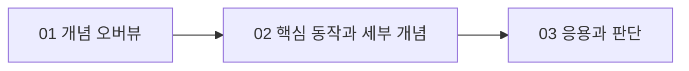

# {{TOPIC_TITLE}} 조사 문서 지도

> 이 문서는 상세 내용을 종합하지 않고 조사 범위, 읽는 순서와 검증 상태를 안내한다.

## 조사 범위

- 대상 버전·환경: {{VERSION_OR_ENVIRONMENT}}
- 포함 범위: {{IN_SCOPE}}
- 제외 범위: {{OUT_OF_SCOPE}}

## 문서 구성

| 순서 | 문서 | 난이도 | 소주제 | 중심 질문 | 선수 문서 | 검증일 |
| --- | --- | --- | --- | --- | --- | --- |
| 01 | [{{OVERVIEW_TITLE}}](./01-overview.md) | overview | overview | {{QUESTION}} | 없음 | {{YYYY-MM-DD}} |
| 02 | [{{DETAIL_TITLE}}](./02-{{SUBTOPIC}}.md) | detail | {{SUBTOPIC}} | {{QUESTION}} | 01 | {{YYYY-MM-DD}} |
| 03 | [{{APPLICATION_TITLE}}](./03-{{APPLICATION}}.md) | application | {{APPLICATION}} | {{QUESTION}} | 01, 02 | {{YYYY-MM-DD}} |

## 선수 관계

## 출처 전략

{{공식 문서, 명세, RFC, 논문 등 어떤 출처를 어떤 범위에 사용했는지 설명}}

## 남은 조사 과제

- {{근거가 부족하거나 후속 검증이 필요한 내용}}
