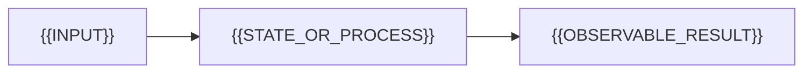

# {{TITLE}}

> **핵심 결론:** {{문서가 증명하거나 설명할 결론과 적용 조건}}

## 질문과 경계

- 중심 질문: {{QUESTION}}
- 포함: {{IN_SCOPE}}
- 제외: {{OUT_OF_SCOPE}}
- 전제: {{VERSION_ENVIRONMENT_ASSUMPTION}}

## 제품·프로젝트 프로필

> 제품, 오픈소스 프로젝트, 프레임워크 또는 플랫폼의 overview에만 사용하고 순수 개념 문서에서는 제거한다.

### 탄생 배경과 철학

{{어떤 문제의식과 개발 방식에서 시작했으며 공식 철학이 어떤 설계 선택으로 드러나는지 설명}}

### 제품군과 배포 경계

| 구성 | 제공 형태 | 관리·운영 주체 | 라이선스·약관 | 핵심 경계 |
| --- | --- | --- | --- | --- |
| {{OSS_CORE_OR_EDITION}} | {{SOURCE_BINARY_SAAS}} | {{MAINTAINER_OR_OPERATOR}} | {{SPDX_OR_TERMS}} | {{WHAT_IS_AND_IS_NOT_INCLUDED}} |

### 소유·관리·거버넌스

{{최초 개발 주체, 현재 법적·상표 소유 주체, 저장소 조직, 실질 maintainer와 의사결정·기여 경로를 구분하고 변천 날짜를 기록}}

### 검증된 특장점과 한계

| 특장점 | 구현 근거 | 유리한 조건 | 비용·한계·대안 |
| --- | --- | --- | --- |
| {{DIFFERENTIATOR}} | {{MECHANISM_EVIDENCE}} | {{WHEN_IT_MATTERS}} | {{TRADEOFF_OR_ALTERNATIVE}} |

## 문제를 정확히 정의하기

{{용어, 불변 조건, 보장과 비보장, 이 문제가 중요한 이유를 연결된 문단으로 설명}}

## 메커니즘

{{구성 요소를 나열하는 데서 끝내지 말고 입력, 상태 변화, 스케줄링 또는 데이터 흐름을 원인에서 결과까지 추적}}



## 정량 모델 또는 실행 불변식

> 해당하지 않으면 복잡도, 상태 전이표, 프로토콜 불변식 또는 실행 순서 분석으로 대체한다.

{{VARIABLES_ASSUMPTIONS_DERIVATION}}

### Worked example

{{실제 값을 대입해 중간 계산과 결과를 보이고, 모델이 현실에서 어긋나는 조건을 설명}}

## 구현과 버전 경계

{{공식 계약과 현재 구현을 분리하고, 공개된 아키텍처·소스·설정이 동작에 미치는 영향을 설명}}

## 실패 모드와 진단

| 관찰 증상 | 가능한 원인 | 구분할 증거 | 다음 확인 |
| --- | --- | --- | --- |
| {{SYMPTOM}} | {{CAUSE}} | {{EVIDENCE}} | {{NEXT_STEP}} |

{{단일 지표로 성급히 결론 내리지 않도록 반례와 진단 순서를 설명}}

## 설계 선택과 트레이드오프

{{어떤 워크로드·제약에서 어떤 선택이 유리한지 조건과 비용을 포함해 논증}}

## 검증 예제

```text
{{재현 가능한 코드, 설정, 실행 추적 또는 측정 예제}}
```

{{예상 결과, 결과가 개념을 증명하는 방식, 실패했을 때 확인할 것}}

## 글 속 인터랙티브 그림 제안

| 문맥 | 독자가 조작할 값 | 바로 관찰할 변화 | 설명할 인과관계 |
| --- | --- | --- | --- |
| {{ARTICLE_SECTION}} | {{INPUT}} | {{FEEDBACK}} | {{CAUSAL_RELATION}} |

대시보드 전체를 만들지 말고 위 개념을 설명하는 문단 직후에 들어갈 작은 인터랙티브 figure로 설계한다.

## 이해 점검

1. **설명:** {{MECHANISM_QUESTION}}
2. **계산·예측:** {{QUANTITATIVE_OR_TRACE_QUESTION}}
3. **진단:** {{FAILURE_DIAGNOSIS_QUESTION}}
4. **설계:** {{TRADEOFF_QUESTION}}

## 근거와 한계

- {{무엇이 공식 계약이고 무엇이 구현 관찰 또는 추론인지}}
- {{검증하지 못한 범위와 결과에 미치는 영향}}
- {{제품 프로필이 있다면 라이선스 적용 범위와 관리 주체를 확인한 공식 원문}}

## 참고 자료

- [{{PRIMARY_SOURCE_TITLE}}]({{DIRECT_URL}}) — {{OWNER}}, {{VERSION_OR_REVISION}}, {{YYYY-MM-DD}} 확인
