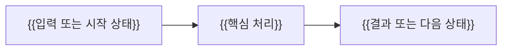

# {{TITLE}}

> {{이 문서가 답하는 질문과 핵심 결론을 한두 문장으로 작성}}

## 조사 질문

- {{이 문서 하나가 답할 중심 질문}}

## 범위

- 포함: {{이 문서가 다루는 범위}}
- 제외: {{다른 번호 문서에서 다룰 범위}}

## 선수 지식

- {{이 문서를 이해하기 위해 필요한 개념}}

## 왜 필요한가

{{해결하려는 문제, 등장 배경, 사용 맥락}}

## 핵심 개념

{{용어 정의, 가장 작은 정신 모델, 구성 요소와 책임}}

## 동작 원리

{{입력부터 출력까지의 단계별 동작과 인과관계}}

### 데이터 플로우



## 인터랙티브 시각화 설계

| 요소 | 설계 |
| --- | --- |
| 핵심 상태 | {{화면에 표현할 상태와 데이터}} |
| 사용자 조작 | {{변경 가능한 입력, 순서, 속도 또는 조건}} |
| 상태 전이 | {{조작에 따른 변화와 애니메이션 순서}} |
| 관찰 피드백 | {{원인과 결과를 연결해 보여줄 값과 설명}} |
| 접근성 | {{키보드, 모션 감소, 색상 외 구분 방식}} |

## 예제

```text
{{최소 단위 예제. 적절한 코드 언어로 변경}}
```

{{예제의 실행 과정과 결과를 설명}}

## 트레이드오프와 경계 조건

- {{장점과 비용}}
- {{적합하거나 부적합한 조건}}
- {{실패 사례 또는 예외}}

## 흔한 오해

### {{오해}}

{{왜 정확하지 않은지와 올바른 이해}}

## 이해도 점검

1. {{핵심 동작을 자신의 말로 설명하는 질문}}
2. {{조건이 바뀌었을 때 결과를 예측하는 질문}}
3. {{대안을 비교하고 선택 근거를 설명하는 질문}}

## 참고 자료

- [{{공식 자료 제목}}]({{DIRECT_URL}}) — {{기관 또는 프로젝트}}, {{적용 버전}}, {{YYYY-MM-DD}} 확인
