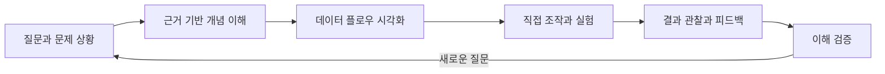
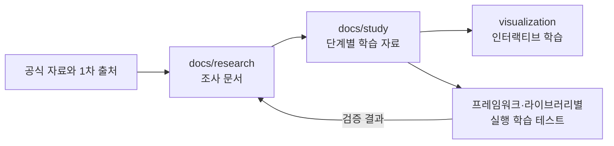

# Developer Study

> 정확한 개념과 인터랙티브한 시각화를 통해 풀스택 개발 지식을 구조적으로 이해하는 학습 공간

Developer Study는 CS(컴퓨터 과학), 프론트엔드, 백엔드, 데이터베이스, 인프라 전반의 핵심 개념을 **읽는 것에서 그치지 않고 직접 관찰하고 조작하며 이해할 수 있도록** 만드는 프로젝트입니다.

단편적인 정의나 사용법을 암기하는 대신, 기술이 등장한 이유와 내부 동작 원리, 데이터가 이동하는 과정, 선택에 따른 결과를 하나의 학습 경험으로 연결합니다. 모든 콘텐츠는 신뢰할 수 있는 근거를 바탕으로 작성하고, 복잡한 동작은 데이터 플로우와 애니메이션으로 시각화합니다.

## 우리가 해결하려는 문제

개발 지식은 서로 연결되어 있지만 대개 분리된 문서와 예제로 학습됩니다. 그 결과 개념을 알고도 실제 시스템에서 어떤 일이 일어나는지 설명하기 어렵거나, 특정 도구의 사용법은 익혔지만 왜 그렇게 동작하는지는 놓치기 쉽습니다.

Developer Study는 다음 질문에 답할 수 있는 학습을 지향합니다.

- 이 기술은 어떤 문제를 해결하기 위해 등장했는가?
- 요청, 데이터, 상태는 시스템 안에서 어떻게 이동하는가?
- 조건이나 설정을 바꾸면 결과는 왜 달라지는가?
- 비슷한 기술과의 차이와 선택 기준은 무엇인가?
- 공식 문서와 표준은 이 동작을 어떻게 정의하는가?

## 학습 경험

각 주제는 정확한 설명과 시각적 탐구, 이해 검증이 하나의 흐름을 이루도록 설계합니다.



### 1. 개념을 맥락과 함께 이해합니다

정의만 나열하지 않습니다. 개념이 필요한 이유, 해결하는 문제, 핵심 원리, 장단점과 트레이드오프를 함께 설명합니다.

### 2. 보이지 않는 흐름을 시각화합니다

브라우저 렌더링, 네트워크 요청, 이벤트 루프, 데이터베이스 인덱스 탐색처럼 눈으로 보기 어려운 동작을 단계별 데이터 플로우와 애니메이션으로 표현합니다.

### 3. 직접 바꾸고 결과를 확인합니다

학습자는 입력값, 실행 순서, 네트워크 상태, 자료구조, 쿼리 조건 등을 조작하고 변화가 시스템에 미치는 영향을 즉시 확인할 수 있습니다.

### 4. 근거를 추적할 수 있게 합니다

핵심 설명에는 공식 문서, 기술 명세, 표준, RFC, 논문 등 신뢰할 수 있는 출처를 연결합니다. 사실, 해석, 학습을 위한 비유를 구분하여 표현합니다.

## 학습 영역

| 영역 | 주요 주제 예시 |
| --- | --- |
| CS | 운영체제, 네트워크, 자료구조, 알고리즘, 컴퓨터 구조 |
| Frontend | 브라우저, 렌더링, JavaScript, React, 접근성, 웹 성능 |
| Backend | 서버 구조, API, 인증과 인가, 동시성, 분산 시스템 |
| Database | 데이터 모델링, 인덱스, 트랜잭션, 격리 수준, 쿼리 최적화 |
| Infra | Linux, 컨테이너, 배포, 클라우드, 관측 가능성, 확장성 |

각 영역은 독립된 지식 모음이 아니라 서로 연결된 시스템으로 다룹니다. 예를 들어 하나의 웹 요청을 브라우저와 네트워크, 서버, 데이터베이스, 인프라의 관점에서 이어서 탐구할 수 있도록 구성합니다.

## 프로젝트 구조

프로젝트는 조사, 학습 자료 가공, 시각화와 실행 기반 학습을 서로 분리하되 같은 주제를 추적할 수 있도록 구성합니다.

```text
.
├── docs/
│   ├── research/<domain>/<topic>/   # 공신력 있는 자료 조사와 근거 정리
│   │   ├── index.md
│   │   ├── 01-overview.md
│   │   ├── 02-<detail>.md
│   │   └── 03-<application>.md
│   └── study/<domain>/<topic>/      # 조사 자료를 가공한 단계별 학습 콘텐츠
│       ├── index.md
│       ├── 01-overview.md
│       ├── 02-<detail-lesson>.md
│       └── 03-<application-lesson>.md
├── visualization/                  # Next.js 기반 인터랙티브 시각화 앱
├── k6/                             # k6 로컬 대상 서버와 실행 시나리오
├── spring/                         # 예: JUnit으로 검증하는 Spring 학습 테스트
├── langchain/                      # 예: LangChain 실행 기반 학습 테스트
└── langgraph/                      # 예: LangGraph 실행 기반 학습 테스트
```

`docs/research`와 `docs/study`는 동일한 `<domain>/<topic>` 경로를 사용합니다. `index.md`는 문서 지도와 탐색 순서만 담당하며, 실제 내용은 하나의 종합 문서에 모으지 않고 개념 오버뷰, 핵심 동작과 세부 개념, 응용과 판단 등 난이도와 소주제에 따라 번호가 붙은 여러 문서로 나눕니다.

루트에는 `spring`, `langchain`, `langgraph`처럼 프레임워크나 라이브러리별 실행 학습 디렉터리를 추가할 수 있습니다. 각 디렉터리는 해당 생태계의 표준 테스트 도구와 프로젝트 구조를 따르며, 문서에서 설명한 동작을 코드와 테스트로 직접 검증하는 실험 공간으로 사용합니다.



## 콘텐츠 원칙

### 정확성

- 공식 문서와 1차 자료를 우선합니다.
- Context7 MCP를 활용해 사용 중인 기술 버전에 맞는 문서를 확인합니다.
- 웹 검색 결과는 출처와 최신성을 검토하고, 필요한 경우 여러 자료로 교차 검증합니다.
- 버전에 따라 달라지는 내용은 대상 버전과 확인 시점을 명시합니다.
- 확정된 사실과 해석, 추론, 비유를 분명히 구분합니다.

### 인터랙션

- 애니메이션은 장식이 아니라 원인과 결과를 설명하는 수단으로 사용합니다.
- 중요한 상태 변화와 데이터 이동을 단계별로 관찰할 수 있게 합니다.
- 재생, 일시 정지, 단계 이동, 초기화 등 학습자가 흐름을 통제할 수 있는 기능을 제공합니다.
- 모션 감소 설정, 키보드 탐색, 색상 외 표현 등 접근성을 고려합니다.

### 설명 방식

- `무엇인가`뿐 아니라 `왜 필요한가`와 `어떻게 동작하는가`를 함께 다룹니다.
- 작은 정신 모델에서 시작해 실제 시스템 수준으로 점진적으로 확장합니다.
- 흔한 오해와 실패 사례를 통해 개념의 경계를 설명합니다.
- 학습 후 스스로 설명하거나 예측할 수 있는지 확인합니다.

## 하나의 주제를 구성하는 기준

하나의 학습 콘텐츠는 필요에 따라 다음 요소를 조합합니다.

1. 학습 목표와 선수 지식
2. 문제 상황과 개념의 등장 배경
3. 핵심 개념과 정신 모델
4. 단계별 데이터 플로우
5. 조작 가능한 시각화 또는 실험
6. 실제 코드와 적용 사례
7. 트레이드오프와 흔한 오해
8. 이해도 확인 질문
9. 참고한 공식 자료와 추가 학습 경로

## 기술 기반

- **Next.js 16.2** — 학습 콘텐츠와 인터랙티브 웹 경험 구성
- **TypeScript 7** — 명확한 데이터 모델과 안전한 상호작용 구현
- **Tailwind CSS** — 일관된 UI와 반응형 학습 화면 설계
- **Context7 MCP · Web Search** — 버전별 공식 문서 탐색과 사실 검증

### 로컬 개발 환경

- 기본 포트: `3113`
- 접속 주소: [http://localhost:3113](http://localhost:3113)

```bash
cd visualization
pnpm install
pnpm dev
```

## 현재 학습 콘텐츠

### k6 부하 테스트

- [공식 근거 조사](./docs/research/infra/k6/index.md) — 개념, 생명주기, executor, metric, 실습 전략
- [단계별 학습 과정](./docs/study/infra/k6/index.md) — 기초 정신 모델부터 테스트 설계까지 6단계
- [실행 실습](./k6/README.md) — smoke, closed/open model, 의도적 threshold 실패
- [인터랙티브 시각화](http://localhost:3113/infra/k6) — 부하 파형, 예상 metric, 품질 게이트, options 코드 생성

시각화의 수치는 개념 학습을 위한 결정론적 모델이며 벤치마크 결과가 아닙니다. 실제 동작은 로컬 k6 실습으로 확인합니다.

## 프로젝트가 지향하는 것

Developer Study의 목표는 정답을 빠르게 보여주는 것이 아니라, 개발자가 **동작을 예측하고, 근거를 설명하고, 상황에 맞는 기술적 선택을 내릴 수 있도록 돕는 것**입니다.

> 외우는 지식에서 설명할 수 있는 이해로, 정적인 문서에서 탐구할 수 있는 경험으로.
