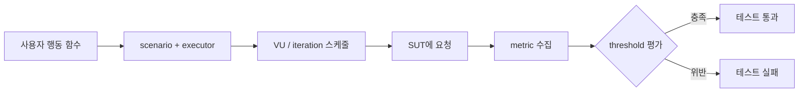

# k6 개념 오버뷰: 부하를 코드로 표현하는 단위

> k6는 JavaScript로 사용자 행동을 정의하고 실행기가 그 행동의 반복과 시작 시점을 스케줄링하는 성능 테스트 도구다. 핵심은 요청을 많이 보내는 것이 아니라 **어떤 행동을 어떤 부하 모델로 실행하고, 어떤 지표로 성공을 판정할지** 코드로 명시하는 데 있다.

## 조사 질문

- k6는 무엇을 어떤 단위로 반복해 시스템에 부하를 만드는가?

## 범위

- 포함: 성능 테스트의 목적, SUT, VU, iteration, scenario, metric의 관계
- 제외: 생명주기의 세부 제약, executor 선택, threshold 문법

## 선수 지식

- HTTP 요청 한 번이 서버에서 처리되고 응답으로 돌아오는 흐름
- 함수 실행과 반복의 기본 개념

## 왜 필요한가

단일 요청의 응답 시간이 빠르다고 해서 여러 사용자가 동시에 접근할 때도 빠르다는 보장은 없다. 성능 테스트는 예상 트래픽에서 응답 시간, 오류율, 처리량이 목표 범위에 머무는지 확인하고, 부하가 커질 때 시스템이 어떻게 저하되는지 관찰한다. k6는 부하·성능, 브라우저 성능, 자동화, 합성 모니터링 등 여러 실행 형태를 지원하는 도구로 소개된다. [Grafana k6 공식 개요](https://grafana.com/docs/k6/latest/)

이 문서의 기준 버전은 [k6 v2.0.0 릴리스](https://github.com/grafana/k6/releases/tag/v2.0.0)다. v2에서는 오래된 CLI와 `externally-controlled` executor 등이 제거됐지만, 이 과정에서 사용하는 HTTP 테스트, scenarios, arrival-rate executors, checks와 thresholds의 핵심 모델은 유지된다.

## 핵심 개념

### SUT

SUT(System Under Test)는 부하를 받는 대상 시스템이다. 실제 운영 시스템에 무단으로 부하를 주면 장애나 비용을 만들 수 있으므로 학습에서는 저장소의 로컬 대상 서버를 사용한다.

### VU

VU(Virtual User)는 테스트 함수를 실행하는 가상 사용자 실행 단위다. VU 수는 곧바로 초당 요청 수가 아니다. 한 iteration이 오래 걸리면 같은 수의 VU가 완료하는 iteration 수는 줄어든다.

### Iteration

iteration은 VU가 scenario function, 보통 `default` 함수를 시작부터 끝까지 한 번 실행한 것이다. VU는 테스트 옵션이 허용하는 동안 이 함수를 반복한다. [k6 테스트 생명주기](https://grafana.com/docs/k6/latest/using-k6/test-lifecycle/)

### Scenario와 executor

scenario는 어떤 함수를 어떤 부하 프로필로 실행할지 정의한다. executor는 VU 수, iteration 수 또는 iteration 도착률 중 무엇을 기준으로 스케줄링할지 결정한다. [k6 scenarios 공식 문서](https://grafana.com/docs/k6/latest/using-k6/scenarios/)

### Metric과 threshold

metric은 응답 시간, 실패율, 실행 횟수처럼 관찰한 값이다. threshold는 metric이 만족해야 할 성공 기준이다. 따라서 k6 테스트는 `행동 → 부하 → 측정 → 판정`의 네 부분으로 읽을 수 있다.

## 동작 원리



정신 모델은 **오케스트라**보다 **교통 발생기**에 가깝다. 스크립트는 차량 한 대의 이동 경로, executor는 차량을 도로에 투입하는 규칙, metric은 센서, threshold는 운영 기준이다. 이 비유는 부하 생성 관계를 설명하지만 실제 VU가 실제 사람의 브라우저나 네트워크를 완전히 재현한다는 뜻은 아니다.

## 인터랙티브 시각화 설계

| 요소 | 설계 |
| --- | --- |
| 핵심 상태 | 시간, 활성 VU, 시작한 iteration, 완료한 iteration, p95, 오류율 |
| 사용자 조작 | executor 유형, VU 또는 도착률, 응답 지연, 실패율, threshold |
| 상태 전이 | 시간 진행에 따라 iteration을 시작·완료하고 metric을 집계 |
| 관찰 피드백 | 닫힌 모델은 지연 증가 시 처리량이 감소하고, 열린 모델은 필요한 VU와 dropped iteration 위험이 증가 |
| 접근성 | 수치 표와 상태 문장을 SVG 그래프와 함께 제공하고 색상 외에 PASS/FAIL 텍스트 사용 |

## 예제

```javascript
import http from 'k6/http';

export const options = {
  vus: 2,
  duration: '10s',
};

export default function () {
  http.get(`${__ENV.BASE_URL}/health`);
}
```

두 VU는 10초 동안 `default` 함수를 반복한다. 요청 시간이 달라지면 각 VU가 완료하는 iteration 수도 달라지므로 `vus: 2`만 보고 요청률을 단정할 수 없다.

## 트레이드오프와 경계 조건

- 프로토콜 수준 테스트는 높은 부하를 효율적으로 만들지만 실제 브라우저 렌더링 비용을 그대로 측정하지 않는다.
- VU 수는 동시 실행 단위를 표현하기 쉽지만 목표 도착률을 일정하게 유지하지는 않는다.
- 학습용 시뮬레이션 수치는 k6 엔진이나 실제 SUT의 측정 결과가 아니다.

## 흔한 오해

### VU 100명은 초당 요청 100개다

정확하지 않다. 한 iteration에 여러 요청과 `sleep`이 들어갈 수 있고 응답 시간도 달라진다. 목표가 초당 시작되는 iteration 수라면 arrival-rate executor를 검토해야 한다.

## 이해도 점검

1. VU와 iteration의 차이를 설명할 수 있는가?
2. 응답 시간이 두 배가 되면 constant-vus의 처리량은 왜 달라질 수 있는가?
3. 테스트 스크립트에서 행동, 부하, 측정, 판정에 해당하는 부분을 찾을 수 있는가?

## 참고 자료

- [Grafana k6 공식 문서](https://grafana.com/docs/k6/latest/) — Grafana Labs, latest/v2 계열, 2026-07-15 확인
- [k6 Test lifecycle](https://grafana.com/docs/k6/latest/using-k6/test-lifecycle/) — Grafana Labs, latest/v2 계열, 2026-07-15 확인
- [k6 Scenarios](https://grafana.com/docs/k6/latest/using-k6/scenarios/) — Grafana Labs, latest/v2 계열, 2026-07-15 확인
- [k6 v2.0.0 release](https://github.com/grafana/k6/releases/tag/v2.0.0) — Grafana Labs, v2.0.0, 2026-07-15 확인
