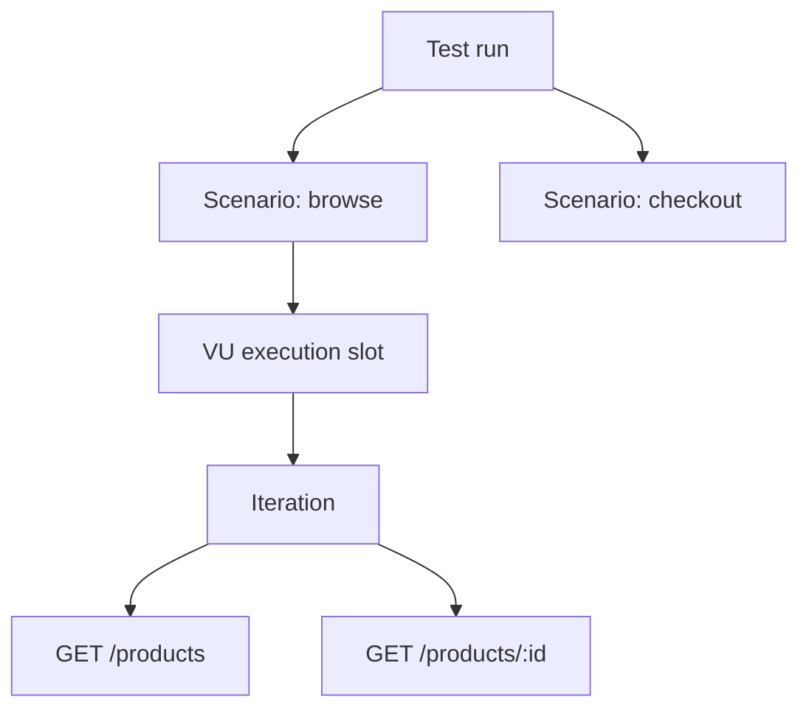

# 성능 테스트의 시스템 모델

## 먼저 정해야 하는 것은 사용자 수가 아니다

성능 테스트는 서버에 요청을 많이 보내는 작업이 아니라 **입력 부하와 관측 결과 사이의 관계를 통제된 조건에서 측정하는 실험**이다. “우리 서비스는 1,000명을 견디는가?”는 아직 실행 가능한 질문이 아니다. 1,000명이 동시에 로그인 화면을 열어 둔 것인지, 초당 1,000건을 계속 보내는 것인지, 읽기와 쓰기의 비율은 얼마인지, 어느 지연시간과 오류율까지 허용할지가 빠져 있기 때문이다.

실행 전 최소한 다음 튜플을 정의해야 한다.

```text
Experiment = (system boundary, workload model, duration,
              traffic mix, data model, SLI, acceptance criteria)
```

- **system boundary**: k6 프로세스, 네트워크, 프록시, 애플리케이션, DB 중 어디까지를 시험하는가
- **workload model**: 동시성(closed)과 도착률(open) 중 무엇을 제어하는가
- **SLI**: `http_req_duration`, 오류율, 처리량처럼 무엇을 관측하는가
- **acceptance criteria**: `p(95) < 300ms`, 오류율 `< 1%`처럼 무엇을 성공으로 볼 것인가

## k6의 네 실행 단위

### Scenario

scenario는 독립된 workload다. executor, 실행 함수, 시작 시점, 환경 변수, 태그를 가진다. 하나의 테스트에서 `browse`는 일정 도착률, `checkout`은 적은 동시 사용자처럼 서로 다른 모델을 동시에 실행할 수 있다. scenario를 단순한 “테스트 단계”로만 이해하면 traffic mix를 표현하는 능력을 놓친다.

### VU

Virtual User는 반복해서 코드를 실행하는 작업자다. 각 VU는 자기 JavaScript VM을 가지며, 한 시점에는 하나의 iteration만 실행한다. VU는 실제 사용자 한 명의 영구적인 디지털 복제물이 아니다. 세션과 쿠키를 유지할 수 있는 **실행 슬롯**에 가깝다.

### Iteration

iteration은 선택된 scenario 함수가 한 번 끝까지 실행된 것이다. 로그인→상품 조회→주문처럼 여러 HTTP 요청을 하나의 비즈니스 흐름으로 묶을 수 있다. 따라서 `iterations/s`와 `http_reqs/s`는 보통 같지 않다.

### Request

request는 iteration 내부의 개별 I/O다. HTTP 요청 하나는 여러 timing sample(`blocked`, `connecting`, `waiting`, `receiving`)을 만든다. 병목을 해석할 때는 iteration 수준의 사용자 흐름과 request 수준의 네트워크 관측을 섞지 않아야 한다.



## worked example: 숫자의 단위를 분리하기

`browse` iteration이 평균 4개의 HTTP 요청을 보내고 초당 25 iteration을 시작한다고 하자. 캐시 재검증이나 재시도가 없다면 기대 HTTP 요청률은 대략 다음과 같다.

```text
request rate ≈ iteration arrival rate × requests per iteration
             ≈ 25 iter/s × 4 req/iter
             ≈ 100 req/s
```

하지만 실제 결과가 108 req/s라면 서버 성능이 좋아졌다는 뜻이 아니다. 리다이렉트, 재시도, 조건 분기, setup 요청이 포함되었는지 확인해야 한다. 반대로 iteration 안의 요청을 병렬화해도 iteration 도착률이 같다면 전체 요청 수는 같을 수 있지만 순간 동시성은 달라진다.

## k6가 관측하는 범위

k6의 HTTP timing은 **부하 생성기에서 본 client-side 결과**다. `waiting`이 늘었다고 곧바로 애플리케이션 코드가 느리다고 결론 낼 수 없다. 큐, 프록시, 네트워크, TLS, 서버, 다운스트림이 합쳐진 결과다. 공식 자동화 가이드도 k6 결과와 함께 SUT의 CPU·메모리·SQL·trace를 상관 분석하라고 권한다.

| 관측 | 말할 수 있는 것 | 그것만으로 말할 수 없는 것 |
| --- | --- | --- |
| `http_req_duration` 상승 | client가 체감한 요청 시간이 증가 | 어느 서버 함수가 원인인지 |
| `http_req_failed` 상승 | expected response 판정 실패 증가 | 비즈니스 오류의 정확한 유형 |
| `iterations` 정체 | 완료된 흐름의 속도 저하 | 도착 요구량 자체가 줄었는지 |
| `dropped_iterations` | 예정된 iteration을 시작하지 못함 | SUT 포화인지 VU 부족인지 단독 판정 |

## 실패하기 쉬운 질문을 실행 가능한 질문으로 바꾸기

| 모호한 질문 | 실행 가능한 형태 |
| --- | --- |
| 1,000명을 견디는가? | 로그인 제외 browse 70%·search 25%·checkout 5%의 120 iter/s를 20분 유지하는가? |
| 응답이 빠른가? | 정상 응답의 `http_req_duration p(95) < 300ms`, `p(99) < 800ms`인가? |
| 에러가 없는가? | 시스템 오류율 `< 0.5%`, 주문 비즈니스 check 실패율 `< 0.1%`인가? |
| 최대 성능은? | 오류율과 p95 SLO를 처음 위반하는 sustainable arrival rate는 얼마인가? |

## 조사 결론

1. VU 수, iteration rate, request rate는 서로 다른 단위다.
2. k6는 client-side 부하와 결과를 제공하지만 원인 진단은 SUT 관측성과 결합해야 한다.
3. executor 선택 전 workload model과 성공 기준을 먼저 명세해야 한다.

## 근거와 한계

- [Scenarios](https://grafana.com/docs/k6/latest/using-k6/scenarios/): scenario의 독립 실행 설정과 복수 workload 근거.
- [Executors](https://grafana.com/docs/k6/latest/using-k6/scenarios/executors/): 제어 변수와 실행 단위 근거.
- [Metrics](https://grafana.com/docs/k6/latest/using-k6/metrics/): built-in metric 의미 근거.
- [Automated performance testing](https://grafana.com/docs/k6/latest/testing-guides/automated-performance-testing/): client-side 결과와 SUT telemetry 결합 근거.
- 이 문서의 산술 예시는 단위를 설명하기 위한 모델이며 redirect·retry·동적 분기를 생략했다.
