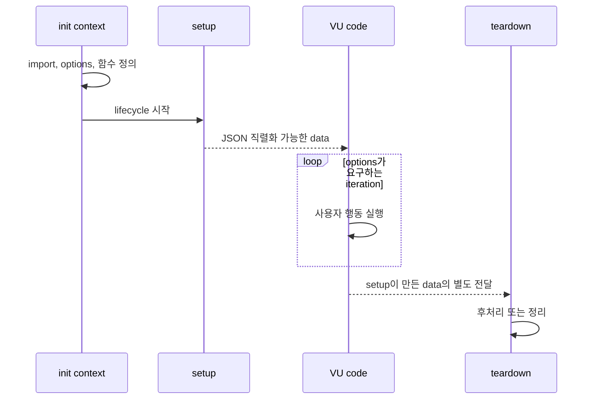

# k6 스크립트와 테스트 생명주기

> k6 스크립트는 `init → setup → VU code → teardown` 순서로 실행된다. 반복 부하에 포함되는 것은 VU code이며, 준비 코드와 테스트 환경 설정을 반복 구간에서 분리해야 측정이 의도와 가까워진다.

## 조사 질문

- init, setup, VU code, teardown은 언제 실행되고 어떤 데이터를 전달할 수 있는가?

## 범위

- 포함: 네 단계의 실행 순서, HTTP 가능 여부, setup 데이터 전달, 반복 경계
- 제외: scenario별 함수 선택, custom summary 상세

## 선수 지식

- [k6 개념 오버뷰](./01-overview.md)
- JavaScript의 import, export와 함수

## 핵심 개념

공식 생명주기는 네 단계다. init context는 필수이며 모듈 import, 파일 읽기, 옵션과 lifecycle function 정의에 사용한다. setup은 선택적으로 테스트당 한 번, VU code는 옵션에 따라 iteration마다 반복, teardown은 선택적으로 테스트당 한 번 실행된다. [k6 Test lifecycle](https://grafana.com/docs/k6/latest/using-k6/test-lifecycle/)

| 단계 | 호출 횟수 | HTTP 요청 | 주 용도 |
| --- | --- | --- | --- |
| init context | VU 초기화마다 실행될 수 있음 | 불가 | import, `open()`, options, 함수 정의 |
| `setup()` | 테스트당 1회 | 가능 | 공통 데이터나 테스트 환경 준비 |
| VU/scenario function | iteration마다 | 가능 | 실제 사용자 행동과 metric 생성 |
| `teardown()` | 정상 setup 이후 테스트당 1회 | 가능 | setup 데이터 기반 정리·후처리 |

init 코드는 재현성을 위해 HTTP 요청을 할 수 없다. `setup()`이 반환한 데이터는 JSON 형태로 VU code와 `teardown()`에 전달할 수 있지만 함수는 전달할 수 없으며, 각 단계가 공유 가변 객체를 다루는 것으로 생각하면 안 된다. [setup 데이터 제약](https://grafana.com/docs/k6/latest/using-k6/test-lifecycle/#use-data-from-setup-in-default-and-teardown)

## 동작 원리



VU는 scenario function을 시작부터 끝까지 순차 실행한 뒤 다시 처음으로 돌아간다. 따라서 함수 안의 `sleep()`과 응답 대기 시간도 iteration duration에 포함되고 closed model의 처리량에 영향을 준다.

## 인터랙티브 시각화 설계

| 요소 | 설계 |
| --- | --- |
| 핵심 상태 | lifecycle 단계, VU 수, iteration 번호, 전달 data |
| 사용자 조작 | 단계 이전·다음, VU 수, setup 실패 여부 |
| 상태 전이 | setup 성공 시 VU 반복으로, setup 예외 시 VU와 teardown 없이 종료 |
| 관찰 피드백 | 각 코드 블록의 호출 횟수와 허용 API를 동시에 강조 |
| 접근성 | 단계 이름·호출 횟수를 텍스트 로그로 제공 |

## 예제

```javascript
import http from 'k6/http';
import { check, sleep } from 'k6';

export const options = {
  vus: 2,
  iterations: 4,
};

export function setup() {
  const response = http.get(`${__ENV.BASE_URL}/health`);
  return { ready: response.status === 200 };
}

export default function (data) {
  const response = http.get(`${__ENV.BASE_URL}/items`);
  check(response, {
    'target was ready': () => data.ready,
    'items returned 200': (res) => res.status === 200,
  });
  sleep(0.2);
}

export function teardown(data) {
  console.log(`target ready before test: ${data.ready}`);
}
```

`setup()`의 요청은 한 번만 실행되고 `/items` 요청은 총 네 iteration에 걸쳐 실행된다. 어떤 VU가 몇 iteration을 맡는지는 `shared-iterations` 계열 스케줄링에 따라 균등하지 않을 수 있으므로 VU별 정확한 횟수가 필요하면 `per-vu-iterations`를 사용한다.

## 트레이드오프와 경계 조건

- setup에서 큰 데이터를 반환하면 VU별 복사 비용이 커진다.
- setup 실패 시 teardown이 호출되지 않을 수 있으므로 setup 내부 실패 정리가 필요하다.
- init에서 동적 네트워크 데이터를 읽으려는 설계는 허용되지 않으며 setup으로 옮겨야 한다.

## 흔한 오해

### 파일 최상단 코드는 테스트 전체에서 딱 한 번만 실행된다

init context는 VU 초기화마다 실행되며 Cloud 환경에서는 더 자주 실행될 수 있다. 전체 테스트 단 한 번의 네트워크 준비가 필요하면 `setup()`의 책임이다.

## 이해도 점검

1. 테스트 데이터 파일 읽기와 로그인 API 호출을 각각 어느 단계에 둘 것인가?
2. `default()`에 데이터 생성 준비를 넣으면 metric 해석이 왜 어려워질 수 있는가?
3. setup에서 반환한 객체를 VU들이 하나의 공유 상태처럼 수정할 수 없는 이유는 무엇인가?

## 참고 자료

- [k6 Test lifecycle](https://grafana.com/docs/k6/latest/using-k6/test-lifecycle/) — Grafana Labs, latest/v2 계열, 2026-07-15 확인
- [k6 Scenarios](https://grafana.com/docs/k6/latest/using-k6/scenarios/) — Grafana Labs, latest/v2 계열, 2026-07-15 확인
