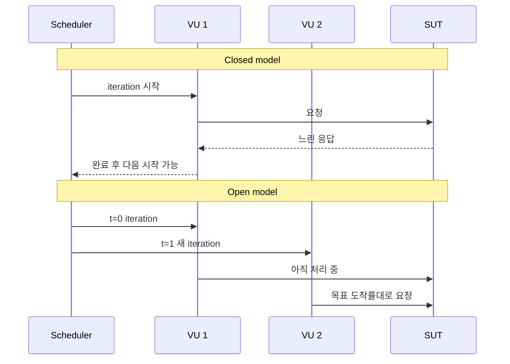

# k6 부하 모델과 scenario executor

> executor 선택은 문법 선택이 아니라 **무엇을 일정하게 유지할 것인가**에 대한 모델 선택이다. closed model은 활성 VU를, open model은 iteration 도착률을 중심으로 부하를 만든다.

## 조사 질문

- 동시 사용자 수와 도착률 중 무엇을 고정해야 하며 어떤 executor가 그 목적에 맞는가?

## 범위

- 포함: scenario, iteration/VU/rate 기반 executor, open/closed 모델, dropped iterations
- 제외: 분산 실행, Cloud 전용 실행 옵션

## 핵심 개념

scenario는 실행할 함수, 시작 시점, 환경 변수, 태그와 executor를 묶는다. 공식 문서는 executor를 iteration 수 기반, VU 수 기반, iteration rate 기반으로 구분한다. [Scenario executors](https://grafana.com/docs/k6/latest/using-k6/scenarios/#scenario-executors)

| 목적 | executor | 모델 | 질문 |
| --- | --- | --- | --- |
| 정해진 작업을 나눠 끝내기 | `shared-iterations` | iteration 기반 | 총 N회가 얼마나 걸리는가? |
| VU마다 같은 횟수 실행 | `per-vu-iterations` | iteration 기반 | 각 사용자 흐름을 N회 수행하는가? |
| 일정 동시 사용자 유지 | `constant-vus` | closed | N명의 반복 사용자가 만드는 부하는? |
| 동시 사용자 단계 변화 | `ramping-vus` | closed | 사용자가 늘고 줄 때 시스템은? |
| 일정 시작률 유지 | `constant-arrival-rate` | open | 초당 N iteration이 도착하면? |
| 시작률 단계 변화 | `ramping-arrival-rate` | open | 도착률 증가에 따른 한계는? |

### Closed model

VU는 iteration이 끝나야 다음 iteration을 시작한다. SUT 응답이 느려지면 iteration도 길어지고 동일한 VU 수가 시작하는 새 작업의 비율은 낮아진다. 목표가 실제 동시 사용자 행동이라면 자연스러울 수 있지만, 목표 처리량을 일정하게 가하는 실험에서는 시스템이 느려질수록 부하가 저절로 줄어드는 coordinated omission을 만들 수 있다. [Open and closed models](https://grafana.com/docs/k6/latest/using-k6/scenarios/concepts/open-vs-closed/)

### Open model

arrival-rate executors는 이전 iteration의 완료와 독립적으로 새 iteration을 시작한다. 응답이 느려지면 목표 도착률을 유지하기 위해 더 많은 VU가 필요하다. `preAllocatedVUs`가 부족하면 시작하지 못한 작업이 `dropped_iterations`에 기록될 수 있다. [Built-in metrics](https://grafana.com/docs/k6/latest/using-k6/metrics/reference/)

## 동작 원리



## 인터랙티브 시각화 설계

| 요소 | 설계 |
| --- | --- |
| 핵심 상태 | 시간, target VU/rate, 응답 지연, 활성 VU, 완료·dropped iteration |
| 사용자 조작 | closed/open 전환, 부하 목표, 지연, pre-allocated VU |
| 상태 전이 | 지연 증가 시 closed는 새 시작 감소, open은 필요한 VU와 dropped 위험 증가 |
| 관찰 피드백 | 동일 조건의 iteration 시작 간격과 실제 throughput 비교 |
| 접근성 | 타임라인과 동일한 데이터를 초 단위 표로 제공 |

## 예제

```javascript
import http from 'k6/http';

export const options = {
  scenarios: {
    steady_arrivals: {
      executor: 'constant-arrival-rate',
      rate: 5,
      timeUnit: '1s',
      duration: '20s',
      preAllocatedVUs: 5,
      maxVUs: 20,
    },
  },
};

export default function () {
  http.get(`${__ENV.BASE_URL}/slow?ms=300`);
}
```

목표는 20초 동안 초당 5개 iteration을 시작하는 것이다. `/slow` 지연이 커질수록 동시 실행을 담당할 VU가 더 필요하다. `maxVUs`까지 사용해도 목표를 따라가지 못하면 dropped iteration을 함께 해석해야 한다.

## 트레이드오프와 경계 조건

- arrival rate는 실제 비즈니스 도착률을 표현하기 좋지만 필요한 load generator 자원이 더 커질 수 있다.
- closed model은 사용자 세션 반복을 표현하기 쉽지만 응답 저하가 부하 감소로 이어질 수 있다.
- `sleep()`을 arrival-rate 함수 끝에 무조건 넣으면 VU 점유 시간이 늘어 필요한 VU 수가 커진다. arrival 간격은 executor가 이미 스케줄링한다.

## 흔한 오해

### open model은 항상 더 현실적이다

아니다. 사용자가 한 작업을 끝낸 뒤 다음 행동을 하는 폐쇄된 사용자 집단이라면 closed model이 적합할 수 있다. 외부에서 독립적으로 요청이 계속 들어오는 API나 작업 큐 도착률을 모델링할 때 open model이 더 직접적이다.

## 이해도 점검

1. checkout 사용자의 반복 행동과 webhook 도착률에는 각각 어떤 모델이 더 적합한가?
2. 응답 지연이 증가할 때 closed와 open 모델의 활성 VU와 throughput은 어떻게 달라지는가?
3. `dropped_iterations`가 발생했을 때 SUT 문제와 load generator 설정을 어떻게 구분할 것인가?

## 참고 자료

- [k6 Scenarios](https://grafana.com/docs/k6/latest/using-k6/scenarios/) — Grafana Labs, latest/v2 계열, 2026-07-15 확인
- [Open and closed models](https://grafana.com/docs/k6/latest/using-k6/scenarios/concepts/open-vs-closed/) — Grafana Labs, latest/v2 계열, 2026-07-15 확인
- [Built-in metrics](https://grafana.com/docs/k6/latest/using-k6/metrics/reference/) — Grafana Labs, latest/v2 계열, 2026-07-15 확인
