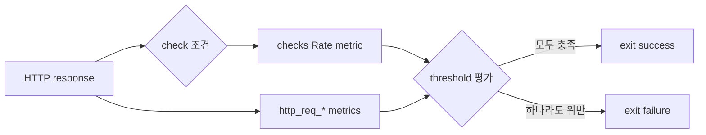

# k6 메트릭, checks와 thresholds

> metric은 관찰한 값, check는 각 응답의 조건 확인, threshold는 테스트 전체의 성공·실패 계약이다. check 실패만으로는 k6 프로세스가 실패하지 않으므로 자동화에서는 threshold와 연결해야 한다.

## 조사 질문

- 응답과 부하에서 수집한 값을 어떻게 자동화 가능한 성공·실패 기준으로 바꾸는가?

## 범위

- 포함: 주요 built-in metrics, 백분위수, checks, thresholds, tags
- 제외: 외부 시계열 저장소와 Grafana 대시보드 구성

## 핵심 개념

### 주요 metric

| metric | 타입 | 의미 |
| --- | --- | --- |
| `vus` | Gauge | 현재 활성 VU 수 |
| `iterations` | Counter | 실행 완료한 iteration 수 |
| `dropped_iterations` | Counter | VU 또는 시간 부족으로 시작하지 못한 iteration 수 |
| `http_req_duration` | Trend | sending + waiting + receiving 시간 |
| `http_req_failed` | Rate | k6의 expected response 기준 실패 요청 비율 |
| `checks` | Rate | 성공한 check의 비율 |

`http_req_duration`은 초기 DNS나 연결 수립 전체를 뜻하지 않으며 sending, waiting, receiving의 합이다. 네트워크 단계별 원인을 볼 때는 `http_req_connecting`, `http_req_tls_handshaking`, `http_req_waiting`도 함께 확인해야 한다. [Built-in metrics](https://grafana.com/docs/k6/latest/using-k6/metrics/reference/)

평균은 긴 지연 일부를 숨길 수 있다. `p(95)<300`은 관찰값의 95%가 300ms 미만이어야 한다는 계약이다. 어떤 percentile과 목표값을 사용할지는 서비스 목표와 사용자 경험에서 정해야 하며, 도구가 대신 결정하지 않는다.

### Check

check는 응답 상태나 본문 같은 boolean 조건을 검증하고 성공률 metric을 만든다. 실패해도 iteration을 중단하거나 테스트를 실패 상태로 끝내지 않는다. [k6 Checks](https://grafana.com/docs/k6/latest/using-k6/checks/)

### Threshold

threshold는 metric 집계값이 만족해야 할 조건이다. 위반하면 테스트가 실패 상태로 끝나 CI 품질 게이트로 사용할 수 있다. `abortOnFail`을 사용하면 조건 위반 후 실행을 중단할 수 있지만 충분한 표본이 쌓이기 전에 판정하지 않도록 `delayAbortEval`을 함께 고려한다. [k6 Thresholds](https://grafana.com/docs/k6/latest/using-k6/thresholds/)

## 동작 원리



## 인터랙티브 시각화 설계

| 요소 | 설계 |
| --- | --- |
| 핵심 상태 | latency sample 배열, 오류 수, check 성공 수, percentile, threshold |
| 사용자 조작 | 지연·오류율, p95 목표, 허용 실패율, 표본 수 |
| 상태 전이 | 새 sample 추가 후 aggregate와 PASS/FAIL 재평가 |
| 관찰 피드백 | 평균과 p95 차이, check와 threshold 결과를 분리 표시 |
| 접근성 | 그래프 외에 sample 표와 판정 문장을 제공 |

## 예제

```javascript
import http from 'k6/http';
import { check } from 'k6';

export const options = {
  thresholds: {
    checks: ['rate>0.99'],
    http_req_failed: ['rate<0.01'],
    http_req_duration: ['p(95)<300'],
  },
};

export default function () {
  const response = http.get(`${__ENV.BASE_URL}/items`, {
    tags: { endpoint: 'items' },
  });

  check(response, {
    'status is 200': (res) => res.status === 200,
    'body has items': (res) => res.json('items.length') > 0,
  });
}
```

응답이 200이어도 본문 check가 실패할 수 있고, 그 반대의 사용자 정의 expected response 정책도 가능하다. 자동화 결과는 check 하나가 아니라 `checks`, `http_req_failed`, `http_req_duration`의 threshold를 함께 해석한다.

## 트레이드오프와 경계 조건

- 표본이 적은 짧은 테스트의 p99는 안정적인 대표값이 아닐 수 있다.
- URL이나 사용자 ID 같은 무제한 값을 tag로 만들면 시계열 cardinality가 폭증할 수 있다.
- threshold를 지나치게 느슨하게 두면 회귀를 놓치고, 환경 변동을 무시하고 지나치게 빡빡하게 두면 불안정한 CI가 된다.

## 흔한 오해

### 모든 check가 통과하면 성능 테스트도 통과다

check는 기능 조건을 기록한다. 응답이 정확해도 p95가 목표를 넘을 수 있고, check 실패 자체도 threshold로 연결하지 않으면 프로세스 실패를 만들지 않는다.

## 이해도 점검

1. `http_req_duration`과 전체 연결 시간의 차이는 무엇인가?
2. 평균 100ms, p95 900ms인 결과에서 평균만 보면 무엇을 놓치는가?
3. check 실패를 CI 실패로 바꾸려면 어떤 threshold를 추가할 수 있는가?

## 참고 자료

- [Built-in metrics](https://grafana.com/docs/k6/latest/using-k6/metrics/reference/) — Grafana Labs, latest/v2 계열, 2026-07-15 확인
- [Checks](https://grafana.com/docs/k6/latest/using-k6/checks/) — Grafana Labs, latest/v2 계열, 2026-07-15 확인
- [Thresholds](https://grafana.com/docs/k6/latest/using-k6/thresholds/) — Grafana Labs, latest/v2 계열, 2026-07-15 확인
- [Tags and groups](https://grafana.com/docs/k6/latest/using-k6/tags-and-groups/) — Grafana Labs, latest/v2 계열, 2026-07-15 확인
