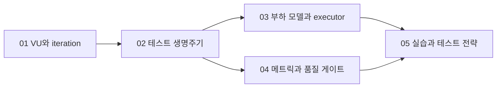

# k6 조사 문서 지도

> 이 문서는 상세 내용을 종합하지 않고 조사 범위, 읽는 순서와 검증 상태를 안내한다.

## 조사 범위

- 대상 버전·환경: Grafana k6 OSS `v2.0.0`, 로컬 CLI 또는 공식 Docker 이미지
- 포함 범위: VU와 iteration, 테스트 생명주기, scenarios와 executors, open/closed 모델, metrics·checks·thresholds, 테스트 유형과 로컬 실습
- 제외 범위: Grafana Cloud k6 과금 기능, 브라우저 모듈 심화, Kubernetes 분산 실행, xk6 확장 개발

## 문서 구성

| 순서 | 문서 | 난이도 | 소주제 | 중심 질문 | 선수 문서 | 검증일 |
| --- | --- | --- | --- | --- | --- | --- |
| 01 | [k6 개념 오버뷰](./01-overview.md) | overview | mental-model | k6는 무엇을 어떤 단위로 부하로 만드는가? | 없음 | 2026-07-15 |
| 02 | [스크립트와 테스트 생명주기](./02-test-lifecycle.md) | foundation | lifecycle | init, setup, VU code, teardown은 언제 실행되는가? | 01 | 2026-07-15 |
| 03 | [부하 모델과 executor](./03-scenarios-and-executors.md) | detail | load-model | 동시 사용자 수와 도착률 중 무엇을 고정해야 하는가? | 01, 02 | 2026-07-15 |
| 04 | [메트릭과 품질 게이트](./04-metrics-checks-thresholds.md) | detail | quality-gates | 측정값을 어떻게 테스트 성공·실패 기준으로 바꾸는가? | 01, 02 | 2026-07-15 |
| 05 | [테스트 전략과 실습 설계](./05-practice-strategy.md) | application | practice | 안전하고 반복 가능한 k6 실습을 어떤 순서로 수행하는가? | 01~04 | 2026-07-15 |

## 선수 관계

## 출처 전략

Grafana k6 공식 문서를 기능 동작의 기준으로 사용하고, `v2.0.0`의 버전 상태와 제거된 기능은 Grafana의 공식 GitHub 릴리스로 교차 검증했다. 예제는 공개 데모 서버에 부하를 주지 않도록 이 저장소의 로컬 대상 서버를 기준으로 재작성한다.

## 남은 조사 과제

- Grafana Cloud k6와 분산 실행은 별도 토픽으로 분리한다.
- 브라우저 기반 성능 테스트는 `k6-browser` 토픽에서 Core Web Vitals와 함께 다룬다.
