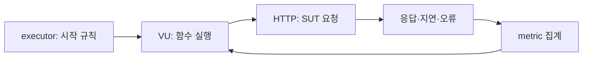

# k6가 만드는 부하의 정신 모델

> 중심 질문: **VU 100개를 실행하면 초당 요청도 100개일까?**

## 이 단계의 위치

- 이전: 시작점
- 현재: 부하를 만드는 최소 단위와 측정 단위를 연결한다.
- 다음: 스크립트 각 부분이 언제 실행되는지 추적한다.

## 학습 목표

- VU, iteration, scenario, metric을 자신의 말로 설명한다.
- 응답 시간이 길어질 때 같은 VU 수의 반복 횟수가 어떻게 변할지 예측한다.
- ‘동시성’과 ‘도착률’을 구분해 요구사항을 표현한다.

## 먼저 생각해 보기

VU 한 개가 `요청 200ms → sleep 800ms`를 반복한다. 이상적인 환경에서 VU 10개의 처리량은 대략 몇 iteration/s일까? 요청이 700ms로 느려지면 어떻게 달라질까?

## 1. 기초 개념

- **SUT(System Under Test)**: 부하를 받으며 관찰되는 시스템이다.
- **VU(Virtual User)**: 시나리오 함수를 독립적으로 반복 실행하는 실행 주체다. 실제 고유 사용자와 일대일 대응하지 않는다.
- **Iteration**: VU가 scenario 함수를 처음부터 끝까지 한 번 실행한 단위다.
- **Scenario**: 어떤 함수를 어떤 executor로, 얼마나 실행할지 정의한 작업이다.
- **Metric**: 실행 중 수집한 표본을 Counter, Gauge, Rate, Trend 형태로 집계한 값이다.

## 2. 정신 모델

> 정신 모델: **executor가 VU 또는 iteration 시작 시점을 정하고, VU가 요청을 보내며, metric이 관찰 결과를 기록한다.**

VU가 만드는 처리량은 VU 수뿐 아니라 한 iteration의 요청 시간, 사용자 대기 시간, 요청 개수에 함께 좌우된다. 이 모델은 부하 생성기의 관점이며 서버 내부 큐·캐시·DB 병목까지 직접 설명하지는 않는다.

## 3. 상세 동작

closed model에서 VU는 이전 iteration이 끝난 뒤 다음 iteration을 시작한다. 위 문제에서 iteration이 1초라면 VU 10개는 약 10 iteration/s지만, 요청이 700ms가 되어 총 1.5초가 되면 약 6.7 iteration/s로 낮아진다. 그래서 ‘VU 10’은 고정 RPS 계약이 아니다.

### 데이터 플로우



## 4. 단계별 예제

```javascript
import http from 'k6/http';
import { sleep } from 'k6';

export const options = { vus: 10, duration: '30s' };

export default function () {
  http.get(`${__ENV.BASE_URL}/items`);
  sleep(0.8);
}
```

| 단계 | 입력 또는 상태 | 발생한 일 | 결과 |
| --- | --- | --- | --- |
| 1 | VU 10 | 10개의 실행 주체가 반복 | 동시 실행 상한 형성 |
| 2 | HTTP 200ms + sleep 800ms | iteration 약 1초 | 이론상 약 10 iteration/s |
| 3 | HTTP 700ms + sleep 800ms | iteration 약 1.5초 | 이론상 약 6.7 iteration/s |

실제 결과에는 연결 비용, 실행기 오버헤드, 여러 요청이 포함되므로 단순 계산과 차이가 생긴다.

## 5. 인터랙티브 시각화 설계

| 요소 | 설계 |
| --- | --- |
| 핵심 상태 | VU 수, 응답 시간, think time, 시간축별 iteration |
| 사용자 조작 | VU·지연·대기 시간 변경 |
| 상태 전이 | VU별 요청→응답→대기→다음 반복 이동 |
| 관찰 피드백 | 예상 iteration/s와 진행 중인 VU 표시 |
| 제어 | 재생, 일시 정지, 한 단계, 초기화 |
| 접근성 | 숫자 표, 상태 텍스트, 모션 감소 대응 |

## 6. 트레이드오프와 경계 조건

- VU 기반 설정은 동시 사용자의 반복 행동을 표현하기 쉽다.
- 목표가 일정 요청 도착률이라면 VU 기반 설정만으로는 부족하다.
- 부하 발생기 자체의 CPU·네트워크 한계도 결과를 왜곡할 수 있다.

## 7. 흔한 오해와 반례

### 오해: VU는 실제 로그인 사용자 수다

VU 하나가 여러 계정을 순환할 수도 있고, 실제 사용자 한 명의 병렬 요청을 여러 VU로 근사할 수도 있다. VU는 실행 모델의 단위이지 비즈니스 사용자 식별자가 아니다.

## 8. 이해도 점검

### 회상

1. VU와 iteration의 관계를 설명하라.

### 예측

2. VU 수와 sleep은 그대로인데 응답 시간이 두 배가 되면 closed model의 처리량은 어떻게 되는가?

### 적용

3. ‘초당 주문 50건’을 재현하려면 VU 수와 도착률 중 어느 쪽을 먼저 명시해야 하는가? 이유도 설명하라.

## 핵심 요약

- VU는 코드를 반복하는 실행 주체이고 iteration은 한 번의 반복이다.
- closed model에서는 응답 지연이 iteration 속도와 처리량에 되먹임된다.
- 동시 사용자 목표와 요청 도착률 목표는 다른 부하 모델을 요구한다.

## 다음 단계

이제 init, setup, VU code, teardown이 각각 언제 실행되고 무엇을 할 수 있는지 추적한다.

## 참고 자료

- [k6 시작 문서](https://grafana.com/docs/k6/latest/get-started/running-k6/) — Grafana k6, v2.0 계열, 2026-07-15 확인
- [Scenarios](https://grafana.com/docs/k6/latest/using-k6/scenarios/) — Grafana k6, 2026-07-15 확인
