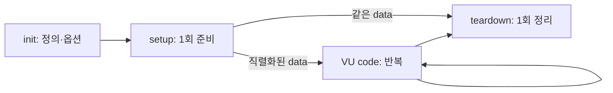

# 스크립트와 테스트 생명주기

> 중심 질문: **스크립트의 각 코드는 테스트 전체에서 언제, 몇 번 실행되는가?**

## 이 단계의 위치

- 이전: VU와 iteration으로 부하를 해석했다.
- 현재: 코드를 실행 구간별 책임으로 나눈다.
- 다음: 실행 시작 규칙인 executor를 선택한다.

## 학습 목표

- 네 생명주기의 실행 시점과 횟수를 구분한다.
- init context에서 네트워크 요청이 허용되지 않는 이유를 설명한다.
- 공유 가능한 setup 데이터와 VU별 상태를 올바른 위치에 둔다.

## 먼저 생각해 보기

테스트 계정 100개를 API로 만든 뒤 VU마다 하나씩 쓰고 싶다. 계정 생성 요청을 파일 최상단, `setup()`, `default()` 중 어디에 두어야 할까?

## 1. 기초 개념

| 구간 | 대략적인 실행 횟수 | 적합한 책임 |
| --- | --- | --- |
| init context | VU 초기화마다 | 모듈 import, 옵션, 파일 로드, VU별 초기 상태 |
| `setup()` | 테스트 전체 1회 | 테스트 데이터 준비, 사전 인증 |
| VU code | iteration마다 | 실제 사용자 행동과 요청 |
| `teardown()` | 테스트 전체 1회 | 정리, setup으로 만든 데이터 해제 |

init context는 부하 테스트 시작 전에 필요한 코드를 준비하고 VU 간 동등한 초기 조건을 만든다. 공식 생명주기에서 init 구간의 HTTP 요청은 허용되지 않는다.

## 2. 정신 모델

> 정신 모델: **준비할 정의는 init, 한 번 만들 공유 데이터는 setup, 반복할 행동은 VU code, 되돌릴 것은 teardown에 둔다.**

분산 실행에서는 init이 로컬 한 번보다 더 많이 평가될 수 있으므로 외부 부작용을 두지 않는다. setup 반환값은 직렬화되어 VU code와 teardown으로 전달되므로 함수나 열린 연결 같은 값은 넘길 수 없다.

## 3. 상세 동작

스크립트를 읽은 뒤 k6가 각 VU의 실행 환경을 초기화한다. `setup()`이 정상 완료되면 그 반환값의 복사본을 VU 함수에 제공한다. 각 VU는 지정된 executor 규칙에 따라 함수를 반복한다. 정상 종료 시 `teardown()`이 실행된다. setup이 실패하면 teardown이 실행되지 않을 수 있으므로 정리 작업은 멱등성을 가져야 한다.

### 데이터 플로우



## 4. 단계별 예제

```javascript
import http from 'k6/http';
import { check } from 'k6';

export const options = { vus: 2, iterations: 4 };

export function setup() {
  const response = http.get(`${__ENV.BASE_URL}/health`);
  return { ready: response.status === 200 };
}

export default function (data) {
  const response = http.get(`${__ENV.BASE_URL}/items`);
  check(response, { 'items available': (r) => data.ready && r.status === 200 });
}

export function teardown(data) {
  console.log(`target was ready: ${data.ready}`);
}
```

| 단계 | 입력 또는 상태 | 발생한 일 | 결과 |
| --- | --- | --- | --- |
| 1 | options/import | VU 실행 환경 준비 | 부하 전 정의 완료 |
| 2 | health 응답 | setup 한 번 실행 | `{ ready }` 전달 |
| 3 | 총 4 iterations | 두 VU가 반복을 공유 | 네 번의 items 요청 |
| 4 | 종료 | teardown 한 번 실행 | 정리·최종 기록 |

## 5. 인터랙티브 시각화 설계

| 요소 | 설계 |
| --- | --- |
| 핵심 상태 | 생명주기 구간, VU별 iteration 번호, 전달 데이터 |
| 사용자 조작 | VU/iteration 변경, setup 실패 토글 |
| 상태 전이 | init→setup→병렬 VU 반복→teardown |
| 관찰 피드백 | 현재 실행 코드와 누적 실행 횟수 |
| 제어 | 이전/다음 단계, 자동 재생, 초기화 |
| 접근성 | 단계 번호와 텍스트 로그를 함께 제공 |

## 6. 트레이드오프와 경계 조건

- setup은 테스트 전 준비에 편리하지만 대량 데이터 생성 시간이 부하 측정과 분리된다.
- VU code의 동적 데이터가 필요하면 VU/iteration 식별자를 이용해 입력을 분배해야 한다.
- teardown만 믿고 중요한 운영 데이터를 만들지 않는다. 강제 종료에도 별도 복구가 가능해야 한다.

## 7. 흔한 오해와 반례

### 오해: 파일 최상단의 변수는 모든 VU가 공유한다

각 VU는 격리된 실행 환경을 가진다. 최상단 코드는 VU 초기화 과정에서 평가되므로 프로세스 전체의 안전한 공유 메모리처럼 취급할 수 없다.

## 8. 이해도 점검

### 회상

1. setup과 init context의 가장 중요한 차이는 무엇인가?

### 예측

2. setup이 예외로 종료되면 VU code와 teardown은 어떻게 될 수 있는가?

### 적용

3. 테스트 주문 생성·조회·삭제를 네 생명주기에 배치하고 이유를 설명하라.

## 핵심 요약

- 생명주기는 정의, 준비, 반복 행동, 정리를 분리한다.
- setup 데이터는 직렬화 가능한 값이어야 한다.
- init의 외부 부작용과 teardown 의존적 복구는 피한다.

## 다음 단계

같은 VU code라도 언제 시작시키느냐에 따라 완전히 다른 부하가 된다. closed/open model과 executor를 비교한다.

## 참고 자료

- [Test lifecycle](https://grafana.com/docs/k6/latest/using-k6/test-lifecycle/) — Grafana k6, 2026-07-15 확인
