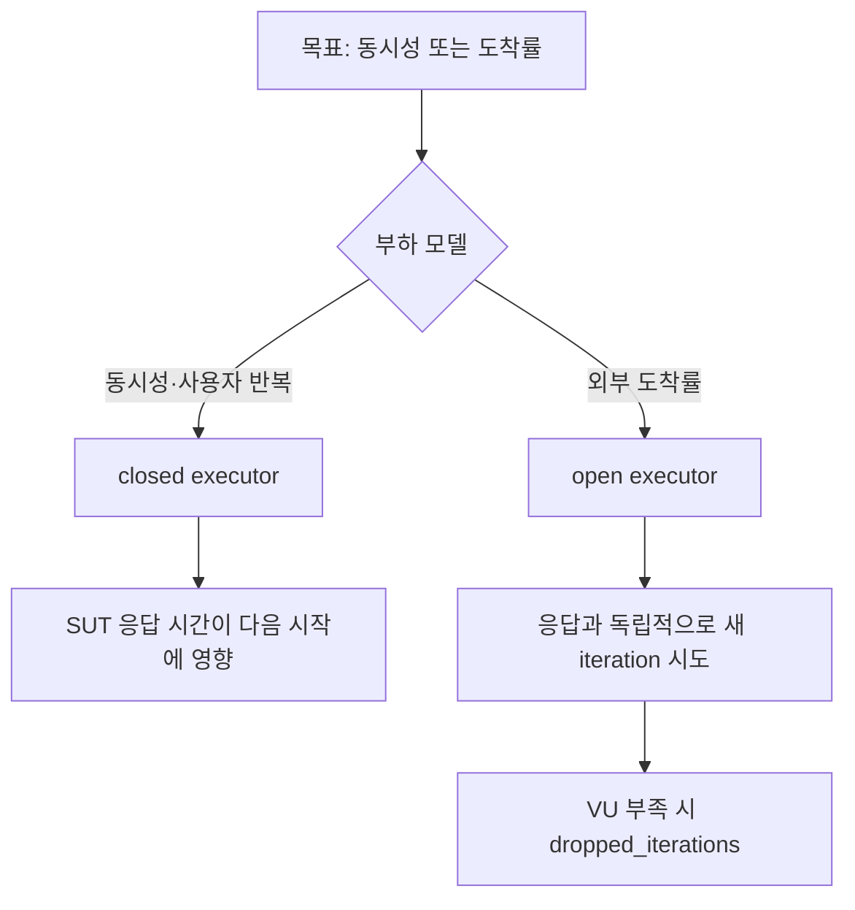

# 부하 모델과 executor

> 중심 질문: **서버가 느려져도 요청 도착률을 유지해야 하는가?**

## 이 단계의 위치

- 이전: VU code가 반복되는 구간을 구분했다.
- 현재: 반복을 언제 시작할지 결정한다.
- 다음: 생성된 요청을 metric과 threshold로 판정한다.

## 학습 목표

- closed model과 open model의 피드백 차이를 설명한다.
- 응답 지연 증가가 두 모델에 미치는 결과를 예측한다.
- 목표에 맞는 scenario executor를 선택한다.

## 먼저 생각해 보기

초당 주문 20건이 들어오는 이벤트를 재현한다. 서버 응답이 200ms에서 1초로 느려졌을 때도 새 주문은 초당 20건씩 도착해야 한다. `constant-vus`와 `constant-arrival-rate` 중 무엇이 맞을까?

## 1. 기초 개념

- **Closed model**: VU가 이전 iteration을 끝낸 뒤 다음 iteration을 시작한다. 응답 지연이 시작률에 영향을 준다.
- **Open model**: 시스템 응답과 독립적으로 정해진 iteration 도착률을 시도한다.
- **Executor**: iteration 또는 VU의 수와 시작 시점을 정하는 알고리즘이다.
- **Scenario**: executor, 실행 함수, 시작 시간, 태그 등을 묶는 독립 실행 단위다.

| 목표 | 대표 executor |
| --- | --- |
| 정해진 총 작업을 VU가 나눔 | `shared-iterations` |
| VU별 같은 횟수 반복 | `per-vu-iterations` |
| 일정/변화하는 동시성 | `constant-vus`, `ramping-vus` |
| 일정/변화하는 도착률 | `constant-arrival-rate`, `ramping-arrival-rate` |

## 2. 정신 모델

> 정신 모델: **closed는 ‘일하는 사람 수’를 고정하고, open은 ‘들어오는 일의 속도’를 고정한다.**

실제 시스템은 두 성격이 섞인다. 화면을 기다리는 사용자는 closed에 가깝고, 외부 이벤트·메시지·예약 트래픽은 open에 가깝다. 모델은 현실을 그대로 복제하는 대신 검증하려는 위험을 분리한다.

## 3. 상세 동작

closed model에서 평균 iteration 시간이 `T`초이고 활성 VU가 `V`개라면 단순화한 처리량은 `V / T`에 가깝다. 지연이 증가하면 처리량이 낮아져 병목에 들어오는 압력이 스스로 줄어드는 **coordinated omission** 위험이 있다.

arrival-rate executor는 목표 시작률을 맞추기 위해 pre-allocated VU를 사용하고 부족하면 max VU 범위에서 더 활성화한다. 그래도 실행 여력이 부족하면 `dropped_iterations`가 발생한다. 이는 SUT뿐 아니라 부하 발생기 용량이나 VU 설정도 점검해야 한다는 신호다.

### 데이터 플로우



## 4. 단계별 예제

```javascript
export const options = {
  scenarios: {
    orders: {
      executor: 'constant-arrival-rate',
      rate: 20,
      timeUnit: '1s',
      duration: '30s',
      preAllocatedVUs: 10,
      maxVUs: 50,
    },
  },
};
```

| 단계 | 입력 또는 상태 | 발생한 일 | 결과 |
| --- | --- | --- | --- |
| 1 | rate 20/s | 스케줄러가 초당 20 iteration 시작 시도 | 도착률 목표 형성 |
| 2 | 응답 지연 증가 | 각 VU의 점유 시간이 길어짐 | 필요한 VU 증가 |
| 3 | maxVUs도 부족 | 일부 시작 시점을 놓침 | dropped_iterations 증가 |

## 5. 인터랙티브 시각화 설계

| 요소 | 설계 |
| --- | --- |
| 핵심 상태 | 모델, 목표 부하, 지연, 활성 VU, 완료·누락 iteration |
| 사용자 조작 | closed/open 전환, 부하·지연·VU 상한 변경 |
| 상태 전이 | 시간축에서 iteration 시작과 완료를 애니메이션 |
| 관찰 피드백 | 실제 시작률, 처리량, dropped count 비교 |
| 제어 | 재생, 일시 정지, 시간 슬라이더, 초기화 |
| 접근성 | 선 종류·레이블·수치로 모델을 중복 표현 |

## 6. 트레이드오프와 경계 조건

- arrival-rate는 목표 트래픽을 선명하게 유지하지만 더 많은 부하 발생기 자원을 요구한다.
- VU 기반 모델은 사용자 흐름을 읽기 쉽지만 느려진 시스템에 압력이 덜 들어갈 수 있다.
- `dropped_iterations`가 0이어도 부하 발생기의 CPU·네트워크 포화 여부를 별도로 본다.

## 7. 흔한 오해와 반례

### 오해: open model이 언제나 현실적이다

사용자가 화면 응답을 기다린 뒤 다음 행동을 하는 흐름에는 응답 지연의 피드백이 실제로 존재한다. 이때 고정 도착률만 적용하면 현실보다 과도한 행동을 만들 수 있다.

## 8. 이해도 점검

### 회상

1. closed와 open model의 iteration 시작 조건을 비교하라.

### 예측

2. 일정 arrival rate에서 응답 시간이 세 배가 되면 활성 VU와 dropped iteration은 어떻게 변할 수 있는가?

### 적용

3. ‘동시 접속 500명’과 ‘초당 결제 80건’ 각각에 맞는 executor 후보와 근거를 쓰라.

## 핵심 요약

- 부하 모델은 응답 지연이 다음 시작에 영향을 주는지를 결정한다.
- executor는 목표 동시성 또는 도착률을 실행 규칙으로 번역한다.
- open model에서는 VU 용량과 dropped_iterations를 함께 관찰한다.

## 다음 단계

부하를 만들었으면 ‘무엇이 성공인가’를 정해야 한다. metric, check, threshold를 분리한다.

## 참고 자료

- [Open and closed models](https://grafana.com/docs/k6/latest/using-k6/scenarios/concepts/open-vs-closed/) — Grafana k6, 2026-07-15 확인
- [Scenario executors](https://grafana.com/docs/k6/latest/using-k6/scenarios/executors/) — Grafana k6, 2026-07-15 확인
