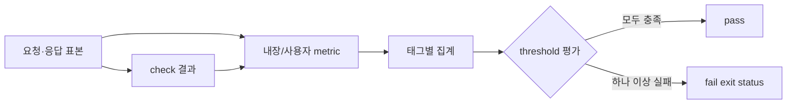

# 메트릭과 품질 게이트

> 중심 질문: **응답이 모두 200이면 성능 테스트는 통과한 것인가?**

## 이 단계의 위치

- 이전: 목표한 방식으로 부하를 만들었다.
- 현재: 결과를 관찰하고 자동 판정한다.
- 다음: 의도한 성공과 실패를 로컬에서 재현한다.

## 학습 목표

- 주요 내장 metric의 타입과 의미를 설명한다.
- check가 실패해도 기본적으로 실행 자체는 실패하지 않는 이유를 안다.
- 요구사항을 실행 가능한 threshold 표현식으로 바꾼다.

## 먼저 생각해 보기

10,000개 요청 중 9,900개가 50ms, 100개가 5초에 성공했다. 평균만 보면 괜찮아 보일 수 있다. 사용자의 긴 꼬리 지연을 어떤 값과 기준으로 잡아야 할까?

## 1. 기초 개념

- `http_req_duration`: sending + waiting + receiving 시간의 Trend다. DNS와 연결 수립 시간은 별도 metric이다.
- `http_req_failed`: HTTP 실패 비율을 나타내는 Rate다.
- `iterations`: 완료된 iteration 수를 세는 Counter다.
- `vus`, `vus_max`: 현재/최대 가능한 VU를 나타내는 Gauge다.
- `dropped_iterations`: 시작해야 했지만 실행하지 못한 iteration의 Counter다.
- **Check**: 응답 또는 상태가 기대한 조건인지 기록하는 불리언 검증이다.
- **Threshold**: metric 집계값이 허용 범위인지 판정하는 품질 기준이다.

## 2. 정신 모델

> 정신 모델: **metric은 사실을 기록하고, check는 개별 기대를 표본화하며, threshold는 전체 실행의 합격선을 결정한다.**

check 실패는 `checks` Rate를 낮추지만 기본적으로 프로세스를 중단하거나 실패 exit code를 만들지 않는다. CI 품질 게이트가 필요하면 `checks`나 HTTP metric에 threshold를 지정해야 한다.

## 3. 상세 동작

각 요청에서 시간·바이트·상태가 표본으로 수집된다. 태그를 사용하면 endpoint, scenario, expected response별로 하위 집합을 만들 수 있다. 실행 종료 시 threshold 표현식이 집계값을 평가한다. 하나라도 실패하면 k6는 테스트 실패를 나타내는 exit status를 반환하므로 자동화에서 배포를 막을 수 있다.

### 데이터 플로우



## 4. 단계별 예제

```javascript
import http from 'k6/http';
import { check } from 'k6';

export const options = {
  thresholds: {
    http_req_failed: ['rate<0.01'],
    'http_req_duration{name:items}': ['p(95)<300'],
    checks: ['rate>0.99'],
  },
};

export default function () {
  const response = http.get(`${__ENV.BASE_URL}/items`, {
    tags: { name: 'items' },
  });
  check(response, { 'status is 200': (r) => r.status === 200 });
}
```

| 단계 | 입력 또는 상태 | 발생한 일 | 결과 |
| --- | --- | --- | --- |
| 1 | HTTP 응답 | 시간·실패 표본 수집 | 내장 metric 갱신 |
| 2 | status check | 참/거짓 기록 | checks rate 갱신 |
| 3 | 실행 종료 | p95·rate 기준 평가 | pass/fail exit status |

## 5. 인터랙티브 시각화 설계

| 요소 | 설계 |
| --- | --- |
| 핵심 상태 | 응답 시간 분포, 오류율, check rate, threshold |
| 사용자 조작 | p95 기준과 오류율·지연 분포 변경 |
| 상태 전이 | 표본 누적→percentile 계산→게이트 판정 |
| 관찰 피드백 | 기준선, 위반 표본, pass/fail 이유 |
| 제어 | 표본 재생, 단계 이동, 초기화 |
| 접근성 | 색상 외 PASS/FAIL 문구와 아이콘 사용 |

## 6. 트레이드오프와 경계 조건

- 너무 느슨한 threshold는 회귀를 놓치고 너무 엄격한 기준은 환경 잡음에 자주 실패한다.
- 평균만 사용하면 일부 사용자의 긴 지연을 숨길 수 있어 percentile을 함께 본다.
- 전체 metric만 보면 특정 endpoint의 문제를 희석할 수 있어 안정된 태그 기준이 필요하다.

## 7. 흔한 오해와 반례

### 오해: check가 모두 통과하면 테스트도 통과한다

모든 응답이 200이어도 p95가 5초일 수 있다. 반대로 check 일부가 실패해도 threshold를 만들지 않았다면 실행 exit status는 성공일 수 있다.

## 8. 이해도 점검

### 회상

1. check와 threshold의 역할을 한 문장씩 설명하라.

### 예측

2. `checks` rate가 97%인데 threshold가 없으면 기본 실행 판정은 어떻게 될 수 있는가?

### 적용

3. ‘검색 p95 400ms 미만, 오류율 0.5% 미만’을 k6 threshold로 표현하라.

## 핵심 요약

- 관찰값과 합격 기준은 분리해 설계한다.
- check만으로는 CI의 실패 판정을 보장하지 않는다.
- percentile, 오류율, 누락 iteration과 endpoint 태그를 함께 본다.

## 다음 단계

이제 로컬 대상 서버에 smoke, closed, open, 의도적 실패 테스트를 차례로 실행한다.

## 참고 자료

- [Built-in metrics](https://grafana.com/docs/k6/latest/using-k6/metrics/reference/) — Grafana k6, 2026-07-15 확인
- [Checks](https://grafana.com/docs/k6/latest/using-k6/checks/) — Grafana k6, 2026-07-15 확인
- [Thresholds](https://grafana.com/docs/k6/latest/using-k6/thresholds/) — Grafana k6, 2026-07-15 확인
