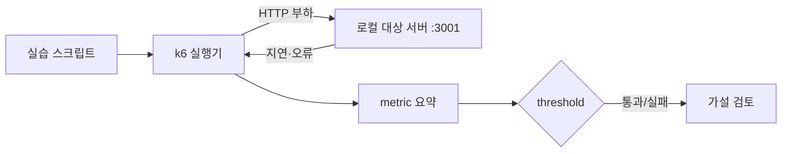

# 로컬 안내형 실습

> 중심 질문: **정상·지연·오류·부하 누락을 안전하고 반복 가능하게 어떻게 관찰하는가?**

## 이 단계의 위치

- 이전: metric과 threshold로 판정 기준을 만들었다.
- 현재: 같은 대상 서버에서 한 변수씩 바꾸며 실제 결과를 관찰한다.
- 다음: 업무 목표에서 자신만의 테스트를 설계한다.

## 학습 목표

- 로컬 대상 서버와 k6 실행기를 분리해 실행한다.
- 네 가지 실습의 가설, 변경 변수, 관찰값을 설명한다.
- 의도적 threshold 실패를 재현하고 정상 실패로 해석한다.

## 먼저 생각해 보기

처음부터 500 VU로 운영 API를 호출하면 무엇을 배울 수 있을까? 대상 허가, 기준선, 중단 기준이 없는 부하는 실험이 아니라 장애가 될 수 있다.

## 1. 기초 개념

이 과정의 [실행 랩](../../../../k6/README.md)은 Node.js로 만든 통제 가능한 SUT와 k6 v2.0.0 시나리오를 분리한다.

| 실습 | 변경하는 것 | 확인하는 것 |
| --- | --- | --- |
| 01 smoke | 최소 반복 | 스크립트와 endpoint의 기본 정상 동작 |
| 02 ramping VUs | 동시성 단계 | closed model의 부하 곡선 |
| 03 arrival rate | 고정 도착률·지연 | 필요한 VU와 dropped iterations |
| 04 threshold failure | 의도적 느린 endpoint | 실패 exit status와 원인 |

## 2. 정신 모델

> 정신 모델: **가설 하나 → 변수 하나 → 관찰값 → 판정 → 다음 실험 순으로 부하를 키운다.**

실습의 목적은 높은 숫자를 만드는 것이 아니라 입력과 결과의 인과관계를 읽는 것이다. 로컬 결과는 운영 용량을 대표하지 않는다.

## 3. 상세 동작

대상 서버는 `/health`, `/items`, `/slow?ms=...`, `/unstable?rate=...`를 제공한다. 터미널 1에서 서버를 실행하고 터미널 2에서 로컬 k6 또는 Docker Compose로 시나리오를 실행한다. 각 스크립트는 `BASE_URL` 환경변수로 대상을 주입받아 실행 환경을 명시한다.

### 데이터 플로우



## 4. 단계별 실습

```bash
cd k6
pnpm target

# 다른 터미널: 로컬 k6
BASE_URL=http://localhost:3001 k6 run scenarios/01-smoke.js

# 또는 Docker
docker compose run --rm k6 run /scripts/01-smoke.js
```

| 단계 | 실행 | 먼저 예측할 값 | 실제로 확인할 값 |
| --- | --- | --- | --- |
| 1 | `01-smoke.js` | 요청·check 모두 성공 | `http_req_failed`, `checks` |
| 2 | `02-ramping-vus.js` | VU 단계에 따라 처리량 증가 | `vus`, `iterations`, p95 |
| 3 | `03-arrival-rate.js` | 지연 증가 시 VU 사용 증가 | 시작률, `dropped_iterations` |
| 4 | `04-threshold-failure.js` | p95 기준 의도적 위반 | 실패한 threshold와 exit status |

네 번째 실습의 실패는 코드 결함이 아니라 학습 목표다. `/slow?ms=350`을 호출하면서 p95 200ms 미만을 요구하므로 실패해야 정확하다.

## 5. 인터랙티브 시각화 설계

| 요소 | 설계 |
| --- | --- |
| 핵심 상태 | 선택 실습, 모델, 부하, 지연, threshold 판정 |
| 사용자 조작 | 레시피 선택, 지연·오류율·기준 변경 |
| 상태 전이 | 준비→부하 증가→측정→판정 |
| 관찰 피드백 | 예상 결과, 실제 실행 명령, 관찰 체크리스트 |
| 제어 | 이전/다음 실습, 재생, 초기화 |
| 접근성 | 명령 복사 없이도 읽을 수 있는 단계 안내 |

## 6. 트레이드오프와 경계 조건

- Docker 실행은 재현성이 좋지만 호스트 연결 방식이 OS 환경에 따라 다를 수 있다.
- 로컬 k6는 빠르지만 설치 버전을 직접 관리해야 한다.
- 허가되지 않은 외부·운영 시스템에는 절대 실습 부하를 보내지 않는다.
- 테스트 데이터 격리, 모니터링, 중단 기준, 부하 발생기 자원 확인이 선행돼야 한다.

## 7. 흔한 오해와 반례

### 오해: smoke test 통과는 성능 목표 달성이다

smoke test는 스크립트와 시스템의 기본 정상 동작만 빠르게 확인한다. 평균 부하·스트레스·브레이크포인트의 위험을 증명하지 않는다.

## 8. 이해도 점검

### 회상

1. smoke test를 본 부하 테스트보다 먼저 실행하는 이유는 무엇인가?

### 예측

2. arrival-rate 실습에서 응답 지연을 크게 올리면 어떤 두 값을 먼저 보겠는가?

### 적용

3. 실습 대상을 팀 개발 환경으로 바꾸기 전에 필요한 안전 체크리스트를 작성하라.

## 핵심 요약

- 작은 검증에서 시작해 한 변수씩 바꾼다.
- 의도적 threshold 실패는 자동 판정이 작동한다는 증거다.
- 로컬 수치는 운영 용량이 아니라 개념과 스크립트의 검증값이다.

## 다음 단계

마지막으로 트래픽 목표, 사용자 흐름, SLO, 위험을 시나리오와 threshold로 번역한다.

## 참고 자료

- [Performance testing guide](https://grafana.com/docs/k6/latest/testing-guides/test-types/) — Grafana k6, 2026-07-15 확인
- [Automated performance testing](https://grafana.com/docs/k6/latest/testing-guides/automated-performance-testing/) — Grafana k6, 2026-07-15 확인
