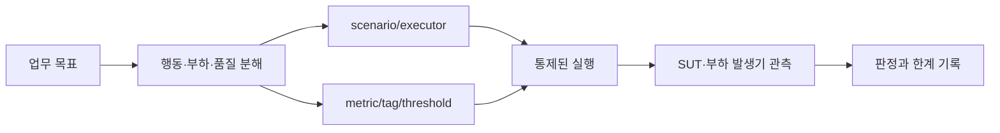

# 목표에서 테스트 설계로

> 중심 질문: **비즈니스 요구사항을 재현 가능하고 판정 가능한 테스트로 어떻게 바꾸는가?**

## 이 단계의 위치

- 이전: 제공된 네 가지 실습으로 인과관계를 확인했다.
- 현재: 새로운 시스템의 테스트를 처음부터 설계한다.
- 다음: CI와 관측 시스템에 연결하고 반복 개선한다.

## 학습 목표

- 트래픽 문장을 동시성·도착률·사용자 흐름으로 분해한다.
- SLO를 metric·tag·threshold로 변환한다.
- 실행 전 안전 조건과 결과 해석 범위를 문서화한다.

## 먼저 생각해 보기

“점심 이벤트에 10만 명이 접속해도 빨라야 한다”는 요구는 바로 테스트할 수 없다. 10만 명은 총 방문자, 동시 사용자, 시간당 도착자 중 무엇인가? ‘빠르다’는 어떤 endpoint의 어느 percentile인가?

## 1. 기초 개념

테스트 설계 입력을 다섯 문장으로 정제한다.

1. **행동**: 어떤 사용자·시스템이 어떤 요청 순서를 수행하는가?
2. **부하**: 동시성인가, 도착률인가, 시간에 따라 어떻게 바뀌는가?
3. **품질**: 어떤 endpoint의 지연·오류·성공 조건을 만족해야 하는가?
4. **환경**: 데이터, 캐시, 의존 시스템, 부하 발생기는 운영과 어떻게 다른가?
5. **안전**: 누가 승인했고 어떤 조건에서 중단하며 어떻게 정리하는가?

## 2. 정신 모델

> 정신 모델: **목표 → 모델 → 시나리오 → 관찰 → 판정 → 해석 한계의 추적 사슬을 만든다.**

스크립트의 숫자마다 요구사항 근거가 있어야 한다. 근거가 없는 VU·duration·threshold는 정확해 보이지만 의미를 보장하지 않는다.

## 3. 상세 동작

예를 들어 “프로모션 시작 후 5분 동안 주문이 50/s에서 200/s로 늘고, 주문 API p95는 500ms 미만이며 실패율은 1% 미만”이라면 다음과 같이 번역한다.

- 외부 도착률이므로 `ramping-arrival-rate` 후보
- `stages`에 50→200 iteration/s 곡선 반영
- 주문 요청에 `name: order` 태그 부여
- `http_req_duration{name:order}: p(95)<500`
- `http_req_failed{name:order}: rate<0.01`
- 목표 도착률 미달을 찾기 위해 `dropped_iterations` 관찰

### 데이터 플로우



## 4. 단계별 예제

```javascript
export const options = {
  scenarios: {
    promotion_orders: {
      executor: 'ramping-arrival-rate',
      startRate: 50,
      timeUnit: '1s',
      preAllocatedVUs: 100,
      maxVUs: 400,
      stages: [
        { target: 50, duration: '1m' },
        { target: 200, duration: '4m' },
      ],
    },
  },
  thresholds: {
    'http_req_duration{name:order}': ['p(95)<500'],
    'http_req_failed{name:order}': ['rate<0.01'],
    dropped_iterations: ['count==0'],
  },
};
```

| 단계 | 입력 또는 상태 | 발생한 일 | 결과 |
| --- | --- | --- | --- |
| 1 | 프로모션 요구 | 용어와 시간을 수치화 | 검증 가능한 목표 |
| 2 | 외부 주문 도착 | open model 선택 | 지연과 독립된 시작률 |
| 3 | API SLO | 태그별 threshold 정의 | endpoint 품질 게이트 |
| 4 | 실행 환경 차이 | 서버·발생기 관측 병합 | 결과 해석 범위 확보 |

## 5. 인터랙티브 시각화 설계

| 요소 | 설계 |
| --- | --- |
| 핵심 상태 | 모델, 단계별 부하, 지연·오류, threshold, VU 용량 |
| 사용자 조작 | closed/open, 부하·지연·기준 슬라이더 |
| 상태 전이 | 요구 입력→부하 곡선→표본→판정 |
| 관찰 피드백 | 생성될 options 코드와 선택 이유 |
| 제어 | 재생, 단계 이동, 시나리오 초기화 |
| 접근성 | 모든 그래프 값을 표와 문장으로 중복 제공 |

## 6. 트레이드오프와 경계 조건

- 실제 사용자 흐름을 세밀하게 복제할수록 유지보수와 데이터 준비 비용이 커진다.
- 통합 환경은 현실적이지만 변수가 많고, 격리 환경은 원인 추적이 쉽지만 운영 대표성이 낮다.
- 테스트 통과는 현재 시나리오·환경·기간의 기준 충족이지 모든 부하에서의 안전 증명이 아니다.
- k6 v2.0.0에서는 제거된 `externally-controlled` executor와 런타임 scale 명령을 새 설계에 사용하지 않는다.

## 7. 흔한 오해와 반례

### 오해: 운영 트래픽의 최고 RPS만 맞추면 현실적인 테스트다

같은 최고 RPS라도 상승 속도, endpoint 혼합, 데이터 편향, cache warm-up, think time이 다르면 시스템의 병목과 결과가 달라진다.

## 8. 이해도 점검

### 회상

1. 테스트 설계의 다섯 입력 문장을 말하라.

### 예측

2. maxVUs가 너무 작으면 SUT가 빠르더라도 어떤 metric이 증가할 수 있는가?

### 적용

3. 자신의 서비스 요구 하나를 행동·부하·품질·환경·안전으로 분해하고 options 초안을 작성하라.

## 핵심 요약

- 모호한 업무 문장을 실행·관찰·판정 가능한 단위로 바꾼다.
- executor와 threshold의 모든 숫자에 요구사항 근거를 연결한다.
- 결과에는 SUT와 부하 발생기의 관측, 환경 차이, 검증 범위를 함께 기록한다.

## 다음 단계

같은 테스트를 CI의 제한된 smoke/average load 단계와 예약된 대규모 실행으로 나누고, 서버 관측 지표와 함께 추세를 관리한다.

## 참고 자료

- [Test types](https://grafana.com/docs/k6/latest/testing-guides/test-types/) — Grafana k6, 2026-07-15 확인
- [Scenarios](https://grafana.com/docs/k6/latest/using-k6/scenarios/) — Grafana k6, 2026-07-15 확인
- [k6 v2.0.0 release](https://github.com/grafana/k6/releases/tag/v2.0.0) — Grafana k6, 2026-05-11
