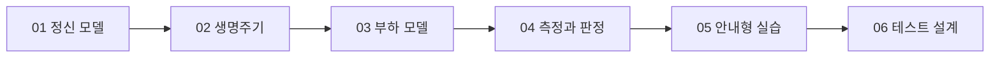

# k6 학습 로드맵

> 성능 테스트가 처음인 풀스택 개발자가 ‘몇 명을 넣어 본다’를 넘어, 의도한 트래픽을 만들고 결과를 품질 기준으로 판정하도록 돕는 과정이다.

## 대상 독자

- HTTP 요청·응답과 JavaScript 기본 문법을 아는 개발자
- k6의 VU, executor, metric, threshold를 서로 연결해 이해하고 싶은 개발자
- 로컬에서 안전하게 실습한 뒤 CI와 실제 시스템으로 확장하려는 개발자

## 최종 학습 목표

- VU, iteration, scenario, executor가 어떤 부하를 만드는지 설명한다.
- 응답 시간이 바뀔 때 closed/open model의 처리량과 VU 사용량을 예측한다.
- check와 threshold를 구분하고 실행 결과를 자동 판정한다.
- 목표 트래픽과 SLO를 근거로 테스트 유형·executor·threshold를 설계한다.

## 시작 전 확인

- HTTP 상태 코드와 percentile의 의미
- JavaScript 모듈과 함수
- Docker 또는 로컬 CLI 사용 경험은 도움이 되지만 필수는 아니다.

## 전체 학습 지도

## 학습 순서

| 순서 | 학습 자료 | 난이도 | 소주제 | 중심 질문 | 선수 지식 | 근거 조사 | 시각화 |
| --- | --- | --- | --- | --- | --- | --- | --- |
| 01 | [k6가 만드는 부하의 정신 모델](./01-why-k6-and-mental-model.md) | foundation | 핵심 단위 | VU는 사용자 수와 같은가? | HTTP | [개념 오버뷰](../../../research/infra/k6/01-overview.md) | 요청 흐름과 반복 |
| 02 | [스크립트와 테스트 생명주기](./02-script-lifecycle.md) | structure | 실행 구간 | 코드는 언제, 몇 번 실행되는가? | 01 | [생명주기](../../../research/infra/k6/02-test-lifecycle.md) | 단계별 실행 추적 |
| 03 | [부하 모델과 executor](./03-load-models-and-executors.md) | mechanism | closed/open model | 지연이 늘면 부하는 어떻게 달라지는가? | 01–02 | [scenario](../../../research/infra/k6/03-scenarios-and-executors.md) | 부하 곡선 실험기 |
| 04 | [메트릭과 품질 게이트](./04-metrics-and-quality-gates.md) | mechanism | 측정·판정 | 성공 여부를 무엇으로 결정하는가? | 01–03 | [metrics](../../../research/infra/k6/04-metrics-checks-thresholds.md) | threshold 판정판 |
| 05 | [로컬 안내형 실습](./05-guided-practice.md) | application | 실행 실습 | 관찰 가능한 실패를 어떻게 재현하는가? | 01–04 | [실습 전략](../../../research/infra/k6/05-practice-strategy.md) | 실행 레시피 |
| 06 | [목표에서 테스트 설계로](./06-design-your-test.md) | judgment | 응용 설계 | 요구사항을 어떤 테스트로 번역하는가? | 01–05 | [전체 조사](../../../research/infra/k6/index.md) | 시나리오 설계기 |

## 이 순서로 배우는 이유

스크립트 문법보다 먼저 부하의 단위를 세운다. 그다음 실행 시점, 부하 생성 방식, 측정과 판정의 인과관계를 쌓고, 동일한 로컬 대상 서버에서 하나씩 검증한다. 마지막에는 정답 스크립트를 복사하지 않고 업무 목표를 테스트 구성으로 번역한다.

## 학습 방법

1. 각 문서의 예측 질문에 먼저 답한다.
2. [인터랙티브 k6 랩](../../../../visualization/src/app/infra/k6/page.tsx)에서 입력을 바꿔 결과를 관찰한다.
3. [실행 실습](../../../../k6/README.md)으로 시뮬레이션과 실제 결과의 차이를 확인한다.
4. 회상·예측·적용 문제를 말이나 글로 설명한다.

## 완료 기준

- VU 수만 보고 RPS를 단정하지 않는다.
- 목표 트래픽에 맞는 executor를 선택하고 선택 근거를 설명한다.
- 최소 하나의 실패 threshold를 재현하고 원인을 메트릭으로 설명한다.
- 테스트 대상의 허가, 데이터 격리, 중단 기준을 포함한 실행 계획을 만든다.

## 근거 범위와 제한

Grafana k6 공식 문서와 k6 v2.0.0을 기준으로 2026-07-15에 구성했다. 시각화의 결과값은 개념 학습용 결정론적 모델이며 실제 네트워크·서버 측정값이 아니다.
